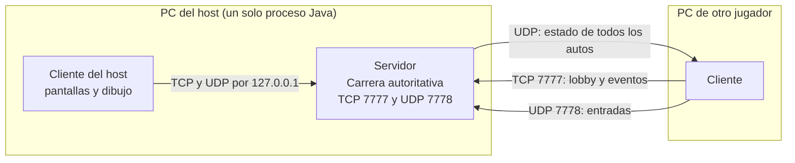
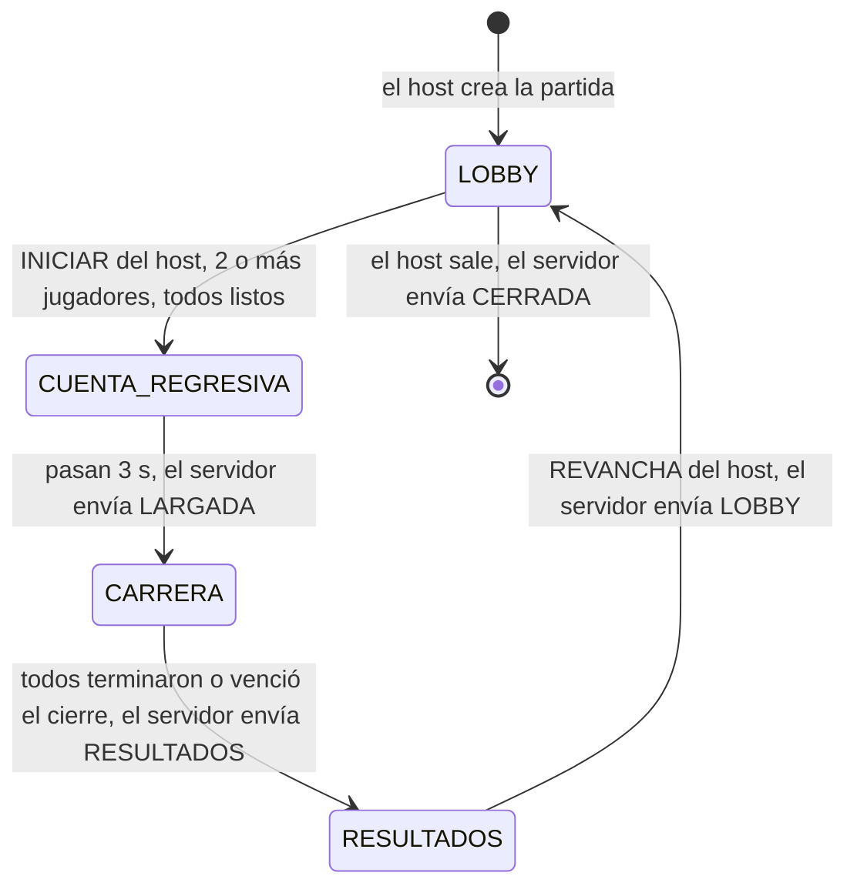
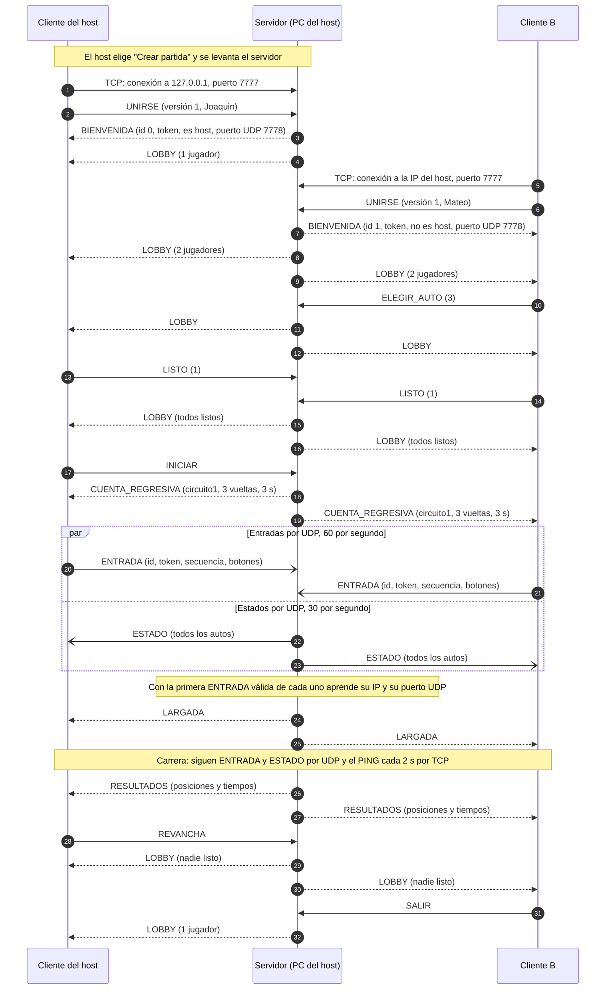

# Protocolo de red de 35 Racing

Especificación de la comunicación en red del juego. Es la referencia para implementar las etapas 6 a 8 y lo que el grupo tiene que poder explicar. Si el código y este documento no coinciden, se corrige uno de los dos: no se deja la diferencia.

**Condiciones de partida:** red local (LAN), de 2 a 5 jugadores, cada uno en su PC, conexión por la IP del host, solo `java.net` (`Socket`, `ServerSocket`, `DatagramSocket`), sin bibliotecas de red de terceros. Versión del protocolo: **1**.

**Criterio general:** se elige lo más simple que funcione bien en una LAN. Las técnicas pensadas para jugar por Internet (predicción, compensación de latencia, compresión) quedan afuera mientras no hagan falta.

---

## 1. Arquitectura

Un jugador crea la partida: es el **host**. En su PC corre un solo proceso Java con dos partes:

- **El servidor** (`red/servidor`): tiene la única `Carrera` que se simula de verdad. Recibe las entradas de todos, avanza la simulación y manda el estado a todos. Es **autoritativo**: lo que dice el servidor es lo que pasó.
- **El cliente del host** (`red/cliente`): el mismo cliente que usan los demás, conectado al servidor por `127.0.0.1`. Así hay un solo camino de código para todos los clientes: el host no tiene atajos ni un caso especial.

Los demás jugadores corren solo el cliente y se conectan a la IP del host.



| Qué | Servidor (solo en la PC del host) | Cliente (en todas las PC, también la del host) |
|---|---|---|
| Simulación | `Carrera`, `Auto`, `Circuito` a 60 ticks por segundo | No simula: dibuja lo que manda el servidor |
| Teclado | No lo lee | Lo lee y lo manda como `ENTRADA` |
| TCP | `ServerSocket` en `Config.PUERTO_TCP` (7777) | Un `Socket` a la IP del host |
| UDP | `DatagramSocket` en `Config.PUERTO_UDP` (7778) | Un `DatagramSocket` en un puerto libre que elige el sistema |
| Pantallas y dibujo | No dibuja | Menú, lobby, carrera, resultados |

El cliente usa un puerto UDP libre (y no el 7778) porque en la PC del host ya lo ocupa el servidor, y porque así se pueden abrir varias instancias en una misma PC para probar. El servidor aprende ese puerto con el primer paquete que recibe (sección 4).

En una misma PC solo puede haber un host a la vez: si el puerto 7777 o el 7778 ya están ocupados, "Crear partida" muestra un error claro en lugar de fallar en silencio.

---

## 2. Máquina de estados de la partida

La partida la maneja el servidor y pasa por cuatro estados. Los estados `CUENTA_REGRESIVA`, `CARRERA` y `RESULTADOS` corresponden a los estados que ya tiene `juego.Carrera` (`CUENTA_REGRESIVA`, `EN_CURSO` y `TERMINADA`); `LOBBY` es cuando todavía no hay carrera.



| Estado | Qué pasa | Qué lo termina | Mensaje que envía el servidor | Siguiente |
|---|---|---|---|---|
| `LOBBY` | Los jugadores entran y salen, eligen auto y marcan "listo". Se aceptan jugadores nuevos. | El host manda `INICIAR`, hay al menos `MIN_JUGADORES` (2) y todos están listos | `CUENTA_REGRESIVA` | `CUENTA_REGRESIVA` |
| `CUENTA_REGRESIVA` | Los autos están en la grilla y no se mueven. Los clientes ya mandan `ENTRADA` (el servidor las ignora, pero aprende la dirección UDP de cada uno) y reciben `ESTADO`. | Pasan `SEGUNDOS_CUENTA_REGRESIVA` (3) | `LARGADA` | `CARRERA` |
| `CARRERA` | Simulación a 60 ticks por segundo con las entradas de cada jugador. | Todos los jugadores conectados terminaron, o venció el cierre de 30 s que arranca cuando termina el primero | `RESULTADOS` | `RESULTADOS` |
| `RESULTADOS` | Se muestra la tabla final. | El host manda `REVANCHA` | `LOBBY` (con todos en "no listo") | `LOBBY` |

En cualquier estado, si el host sale del juego el servidor manda `CERRADA` a todos y se apaga. En `CUENTA_REGRESIVA`, `CARRERA` y `RESULTADOS` no se aceptan jugadores nuevos (`ERROR;CARRERA_EN_CURSO`).

---

## 3. Mensajes TCP

**Formato:** texto UTF-8, un mensaje por línea terminada en `\n`, campos separados por `;`. El primer campo es el nombre del mensaje.

Reglas para que ambos lados se entiendan igual:

- **Escribir** con un `Writer` en UTF-8, agregando `"\n"` a mano y haciendo `flush()` después de cada mensaje. No usar `println`, porque en Windows escribe `\r\n`.
- **Leer** con `BufferedReader.readLine()` sobre un `InputStreamReader` en UTF-8, y separar con `linea.split(";", -1)` (el `-1` conserva los campos vacíos).
- **Tiempos siempre en milisegundos enteros.** Nunca números con decimales: en una PC configurada en español, `String.format` escribe `1,5` y del otro lado no se puede leer como número.
- **Nombres de jugador:** de 1 a 12 caracteres, solo letras, números y espacios. Así nunca contienen `;` ni saltos de línea y no rompen el formato.
- Los dos lados activan `socket.setTcpNoDelay(true)`: los mensajes son chicos y sin esto el sistema operativo puede retenerlos unos milisegundos para juntarlos.
- Un mensaje desconocido o mal formado se ignora (y se registra si `Config.DEBUG_RED` está activo). Nunca debe hacer caer al servidor.

### Del cliente al servidor

| Mensaje | Campos | Cuándo se envía |
|---|---|---|
| `UNIRSE;<version>;<nombre>` | versión del protocolo (hoy `1`); nombre del jugador | Primer mensaje, apenas se conecta. Cualquier otro mensaje antes de este se ignora. |
| `ELEGIR_AUTO;<auto>` | número de auto, de 0 a 4 (cada uno es un color) | En el lobby, al elegir otro auto |
| `LISTO;<valor>` | `1` = listo, `0` = no listo | En el lobby |
| `INICIAR` | (ninguno) | Solo el host, en el lobby |
| `REVANCHA` | (ninguno) | Solo el host, en resultados |
| `SALIR` | (ninguno) | Al abandonar la partida, en cualquier estado |
| `PING;<marca>` | un número cualquiera, que el servidor devuelve igual | Cada `INTERVALO_PING` (2 s), siempre |

### Del servidor al cliente

| Mensaje | Campos | Cuándo se envía |
|---|---|---|
| `BIENVENIDA;<id>;<token>;<esHost>;<puertoUdp>` | id asignado (0 a 4); token para los paquetes UDP (entero al azar); `1` si es el host; puerto UDP del servidor | Respuesta a un `UNIRSE` aceptado |
| `LOBBY;<idHost>;<cantidad>;` y, por cada jugador, `<id>;<nombre>;<auto>;<listo>` | quién es el host; cantidad de jugadores; los datos de cada uno | A todos, cada vez que cambia algo del lobby (entra o sale alguien, elige auto, marca listo, revancha) |
| `CUENTA_REGRESIVA;<circuito>;<vueltas>;<segundos>` | nombre del circuito (hoy `circuito1`); vueltas (3); duración de la cuenta (3) | A todos, al aceptar `INICIAR` |
| `LARGADA` | (ninguno) | A todos, cuando termina la cuenta (el "¡YA!") |
| `SALIO;<id>` | id del jugador que se fue | A todos, durante la carrera, cuando alguien abandona o se cae |
| `RESULTADOS;<cantidad>;` y, por cada jugador, `<posicion>;<id>;<nombre>;<totalMs>;<mejorVueltaMs>` | tiempos en milisegundos; `-1` si no terminó o no completó ninguna vuelta | A todos, cuando la carrera pasa a `TERMINADA` |
| `ERROR;<codigo>;<detalle>` | código de la tabla de abajo; texto para mostrar | Cuando un pedido no se puede cumplir |
| `CERRADA;<motivo>` | texto para mostrar | A todos, cuando el host cierra la partida |
| `PONG;<marca>` | la misma marca del `PING` | Respuesta a cada `PING` |

Al unirse, el servidor le asigna al jugador el **primer auto libre**, así nadie queda sin auto; `ELEGIR_AUTO` lo cambia si el pedido está libre. El orden en la grilla de largada es el orden de llegada al lobby. **El host es el primer jugador que se une**: es el que crea la partida y su cliente se conecta a su propio servidor enseguida. Una conexión que no manda `UNIRSE` (ni nada) queda sin datos, y a los 6 s el servidor la cierra por timeout.

Ejemplo de `LOBBY` con dos jugadores, donde el host (id 0) eligió el auto 0 y está listo, y el otro eligió el auto 3 y no está listo:

```text
LOBBY;0;2;0;Joaquin;0;1;1;Mateo;3;0
```

### Errores

| Código | Cuándo | ¿Cierra la conexión? |
|---|---|---|
| `PARTIDA_LLENA` | Ya hay `MAX_JUGADORES` (5) jugadores | Sí |
| `CARRERA_EN_CURSO` | Alguien intenta unirse fuera del lobby | Sí |
| `NOMBRE_REPETIDO` | Otro jugador ya usa ese nombre (sin distinguir mayúsculas) | Sí |
| `VERSION_DISTINTA` | La versión del `UNIRSE` no es la del servidor | Sí |
| `NOMBRE_INVALIDO` | Nombre vacío, de más de 12 caracteres o con caracteres no permitidos | Sí |
| `AUTO_OCUPADO` | `ELEGIR_AUTO` de un auto que ya tiene otro jugador | No |
| `NO_PERMITIDO` | `INICIAR` o `REVANCHA` de alguien que no es el host, o en un estado en que no corresponde | No |
| `FALTAN_JUGADORES` | `INICIAR` con menos de 2 jugadores o con alguno que no está listo | No |

Cuando el error cierra la conexión, el servidor manda el `ERROR` y después cierra el socket, para que el cliente pueda mostrar el motivo. Los errores se comprueban en este orden: `VERSION_DISTINTA`, `CARRERA_EN_CURSO`, `PARTIDA_LLENA`, `NOMBRE_INVALIDO` y `NOMBRE_REPETIDO`. Para `INICIAR`, el host también tiene que estar listo: "todos listos" incluye a todos los jugadores.

---

## 4. Mensajes UDP

**Formato:** binario, armado y leído con `ByteBuffer` en el orden por defecto de Java (big-endian, el mismo en los dos lados). Cada datagrama es un mensaje completo. Hay dos tipos, identificados por el primer byte.

Los `byte` de Java tienen signo: un campo que puede pasar de 127 se lee con `buffer.get() & 0xFF`.

### `ENTRADA` (cliente → servidor): 11 bytes

| Byte | Tamaño | Campo | Tipo en Java | Valor |
|---|---|---|---|---|
| 0 | 1 | tipo | `byte` | `1` |
| 1 | 1 | id del jugador | `byte` | 0 a 4, el de la `BIENVENIDA` |
| 2 a 5 | 4 | token | `int` | el de la `BIENVENIDA` |
| 6 a 9 | 4 | secuencia | `int` | contador del cliente, sube de a 1 en cada envío |
| 10 | 1 | botones | `byte` | bit 0 acelerar, bit 1 frenar, bit 2 izquierda, bit 3 derecha |

El servidor arma la `EntradaAuto` con esos bits: `acelerar` y `frenar` directo, y `giro = izquierda - derecha` (con las dos apretadas, 0).

La entrada es un **estado** (qué botones están apretados ahora) y no un evento ("se apretó el acelerador"). Por eso no importa perder una: la siguiente, 17 ms después, trae lo mismo.

### `ESTADO` (servidor → todos): 12 + 24 × cantidad de autos bytes

Un solo datagrama lleva todos los autos. Con 5 autos son **132 bytes**, muy por debajo de los 1.472 bytes que entran en un paquete de Ethernet sin fragmentarse.

Cabecera (12 bytes):

| Byte | Tamaño | Campo | Tipo en Java | Valor |
|---|---|---|---|---|
| 0 | 1 | tipo | `byte` | `2` |
| 1 a 4 | 4 | tick | `int` | número de tick de la simulación del servidor; hace de secuencia |
| 5 | 1 | estado de la carrera | `byte` | 0 cuenta regresiva, 1 en curso, 2 terminada |
| 6 a 9 | 4 | reloj | `float` | segundos de carrera; negativo durante la cuenta regresiva (-2,4 = faltan 2,4 s) |
| 10 | 1 | cierre | `byte` | segundos que quedan de cierre, redondeados hacia arriba; 255 = no hay cierre |
| 11 | 1 | cantidad de autos | `byte` | N, de 1 a 5 |

Después, un bloque de 24 bytes por auto (los desconectados también van, con su bandera):

| Byte (dentro del bloque) | Tamaño | Campo | Tipo en Java | Valor |
|---|---|---|---|---|
| 0 | 1 | id del jugador | `byte` | 0 a 4 |
| 1 a 4 | 4 | x | `float` | píxeles de mundo |
| 5 a 8 | 4 | y | `float` | píxeles de mundo |
| 9 a 12 | 4 | ángulo | `float` | grados (0 = derecha, 90 = arriba) |
| 13 | 1 | vueltas completadas | `byte` | 0 a 3 |
| 14 | 1 | posición en carrera | `byte` | 1 a 5 |
| 15 | 1 | banderas | `byte` | bit 0 terminó, bit 1 desconectado |
| 16 a 19 | 4 | tiempo | `float` | segundos de la vuelta actual; si terminó, el tiempo total |
| 20 a 23 | 4 | mejor vuelta | `float` | segundos; `NaN` si todavía no completó ninguna |

No se manda la velocidad: el cliente la estima con la diferencia entre dos estados (la necesita la cámara para adelantarse).

### Secuencia: paquetes atrasados y duplicados

UDP puede entregar paquetes desordenados, duplicados o no entregarlos. Cada lado guarda el número más alto que recibió de cada emisor y **descarta todo paquete con un número menor o igual**. Eso resuelve los duplicados (mismo número) y los atrasados (número viejo) con una sola comparación.

- `ENTRADA`: la secuencia la lleva cada cliente, empieza en 0 cuando se conecta y nunca vuelve atrás, ni entre carreras. El servidor guarda la última por jugador.
- `ESTADO`: la secuencia es el tick del servidor, que tampoco vuelve atrás entre carreras. Además sirve para saber en qué momento de la simulación se tomó ese estado (tick / 60 = segundos), que el cliente necesita para interpolar (sección 6).

No hace falta manejar el desborde del contador: un `int` que sube 60 veces por segundo tarda 414 días en llenarse.

### Cómo aprende el servidor la dirección UDP de cada cliente

El servidor no sabe de antemano a qué puerto UDP mandarle a cada cliente, porque lo elige el sistema operativo del cliente. Lo aprende así:

1. Al aceptar el `UNIRSE` (por TCP), el servidor genera un **token** al azar para ese jugador y lo manda en la `BIENVENIDA`.
2. Desde la `CUENTA_REGRESIVA`, el cliente manda `ENTRADA` con su id y ese token.
3. Cuando llega una `ENTRADA` con id y token correctos, el servidor guarda la dirección y el puerto de origen del datagrama (`DatagramPacket.getSocketAddress()`) y desde ahí le manda los `ESTADO` a esa dirección. Si un paquete válido llega desde otra dirección, se actualiza.

Un paquete con token equivocado, con un id que no existe o con un tamaño que no corresponde se descarta. El token no es una medida de seguridad fuerte: sirve para no confundir paquetes de otra partida o de una conexión anterior.

Como el servidor le contesta a la misma dirección desde la que el cliente le escribe, los `ESTADO` pasan por el firewall de Windows del cliente como respuesta, sin configurar nada del lado del cliente. En la PC del host sí hay que permitir Java en el firewall (Windows lo pregunta la primera vez que se abre el puerto).

---

## 5. Frecuencias y ancho de banda

| Qué | Frecuencia | Constante |
|---|---|---|
| Tick de simulación del servidor | 60 por segundo (cada 16,7 ms) | `TICKS_POR_SEGUNDO` (ya existe) |
| `ENTRADA`, de cada cliente | 60 por segundo | `ENVIOS_ENTRADA_POR_SEGUNDO` |
| `ESTADO`, del servidor a cada cliente | 30 por segundo (uno cada 2 ticks) | `ENVIOS_ESTADO_POR_SEGUNDO` |
| `PING` por TCP | cada 2 s | `INTERVALO_PING` |

### Cuenta del ancho de banda con 5 jugadores

A cada datagrama se le suman 28 bytes de cabeceras (20 de IP y 8 de UDP). No se cuenta la trama Ethernet.

| Flujo | Tamaño con cabeceras | Por cliente | En la placa de red del host |
|---|---|---|---|
| `ESTADO` | 132 + 28 = 160 bytes | 160 × 30 = **4.800 bytes/s** que recibe cada cliente | Salen 4 × 4.800 = **19.200 bytes/s** hacia los 4 remotos (el quinto, el propio host, va por `127.0.0.1` y no pasa por la red) |
| `ENTRADA` | 11 + 28 = 39 bytes | 39 × 60 = **2.340 bytes/s** que envía cada cliente | Entran 4 × 2.340 = **9.360 bytes/s** |
| TCP | Unos pocos mensajes por segundo en el lobby y un `PING` cada 2 s | Despreciable | Despreciable |

Total en la placa del host: 19.200 + 9.360 = **28.560 bytes/s, unos 0,23 Mbit/s**, el 0,23 % de una red de 100 Mbit/s. En paquetes: salen 120 y entran 240 por segundo. Ni la red cableada ni una Wi-Fi común tienen problema con eso.

Si hiciera falta mandar los estados a 60 Hz (sección 6), serían 9.600 bytes/s por cliente y 0,38 Mbit/s en el host: sigue siendo muy poco.

---

## 6. Cliente: interpolación

El cliente no simula: dibuja los estados que le manda el servidor. Pero los estados llegan cada 33 ms y la pantalla se dibuja cada 16,7 ms (o más seguido), y además la red no los entrega a intervalos perfectos. Si se dibujara siempre el último estado recibido, los autos avanzarían a saltos.

La solución es **dibujar un poco en el pasado**: el cliente dibuja el momento `ahora - RETRASO_INTERPOLACION` (100 ms). Para ese momento casi siempre tiene un estado anterior y uno posterior, y dibuja un punto intermedio entre los dos.

1. **Reloj del servidor.** El cliente lleva una estimación del tiempo del servidor, `relojServidor`. En cada cuadro le suma el `delta`. Cuando llega un `ESTADO` aceptado, calcula `t = tick / 60`: si la diferencia con `relojServidor` es mayor a 0,25 s, salta a `t`; si no, corrige un 10 % de la diferencia (así no hay saltos por la variación normal de la red).
2. **Momento a dibujar:** `tDibujo = relojServidor - RETRASO_INTERPOLACION`.
3. **Buscar los estados.** En el búfer de estados recibidos (el último segundo alcanza), busca el par A y B con `tA ≤ tDibujo ≤ tB`.
4. **Interpolar.** `alfa = (tDibujo - tA) / (tB - tA)`, y para cada auto: `x = xA + (xB - xA) × alfa` (lo mismo con `y` y con el ángulo). El ángulo del modelo no se normaliza a 0-360, así que se interpola directo. Si algún día se normaliza, hay que interpolar por el camino más corto.
5. **Si no hay estado posterior** (se perdieron varios paquetes seguidos), el auto se queda en el último estado conocido. No se extrapola.
6. **HUD y carteles:** la vuelta, la posición y los tiempos se toman del estado más reciente; la cuenta regresiva sale del reloj de la cabecera (`ceil(-reloj)`).

**Por qué 100 ms:** son 3 intervalos de envío (3 × 33,3 ms). Aunque se pierdan 2 paquetes seguidos, sigue habiendo un estado posterior para interpolar y no se nota nada.

### ¿Hace falta predecir el auto propio en LAN?

**En la primera versión, no.** En una LAN un paquete tarda de 1 a 5 ms en ir y volver, así que la red en sí no genera una demora que se note. La demora que sí existe viene de las decisiones de esta sección. Desde que el jugador aprieta una tecla hasta que ve moverse su auto:

| Paso | Típico | Peor caso |
|---|---|---|
| Espera hasta el próximo envío de `ENTRADA` (60 Hz) | 8,3 ms | 16,7 ms |
| Viaje por la red (ida) | 1 ms | 2 ms |
| Espera hasta el próximo tick del servidor | 8,3 ms | 16,7 ms |
| Espera hasta el próximo `ESTADO` (30 Hz) | 16,7 ms | 33,3 ms |
| Viaje por la red (vuelta) | 1 ms | 2 ms |
| Retraso de interpolación | 100 ms | 100 ms |
| **Total** | **unos 135 ms** | **unos 171 ms** |

Casi toda la demora es el retraso de interpolación, no la red. En un juego de carreras 135 ms en la dirección pueden notarse. El plan para la etapa 7:

1. Probar con los valores iniciales (30 Hz y 100 ms).
2. Si la dirección se siente "pesada", pasar a **60 Hz y 50 ms** cambiando dos constantes: la demora típica baja a **unos 77 ms** (peor caso, 104 ms) y el tráfico sigue siendo mínimo (sección 5).
3. Solo si todavía no alcanza, agregar predicción del auto propio (simularlo también en el cliente con sus propias entradas y corregirlo con lo que dice el servidor). El modelo lo permite porque `Auto.actualizar` es determinístico, pero suma complejidad, y por eso queda como último recurso.

**Medido en la etapa 7** (servidor y clientes reales en una PC, 30 Hz y 100 ms): desde que un cliente aprieta el acelerador hasta el primer movimiento de ese auto en otra pantalla pasan **unos 97 ms** (entre 90 y 104 en 6 mediciones), menos que los 135 estimados. La diferencia es que el movimiento empieza a verse apenas el momento a dibujar pasa el último estado en que el auto estaba quieto, sin esperar a llegar al primer estado en movimiento. Como referencia, sin red la física sola tarda 100 ms en correr 1 px un auto parado. Por eso se mantuvieron los valores iniciales.

---

## 7. Hilos

### Servidor (dentro del proceso del host)

| Hilo | Qué hace | Cuántos |
|---|---|---|
| Aceptación | Espera conexiones con `ServerSocket.accept()`; por cada una crea la conexión y arranca su hilo lector | 1 |
| Lector TCP | Lee líneas de un cliente. Contesta el `PING` al instante y todo lo demás lo pone en la **cola de eventos**. Si la conexión se corta, pone un evento de desconexión | 1 por jugador (hasta 5) |
| Receptor UDP | Espera `ENTRADA` con `DatagramSocket.receive()`; valida tamaño, id, token y secuencia, y guarda los botones como la **última entrada** de ese jugador | 1 |
| Simulación | Ciclo a 60 ticks por segundo (sección 5). Es el **único** que toca el estado de la partida | 1 |

**Regla principal: el estado de la partida (jugadores, lobby, `Carrera`) lo toca un solo hilo, el de simulación.** Así no hacen falta `synchronized` en el modelo ni pueden aparecer condiciones de carrera en él. Los otros hilos solo le pasan datos por dos vías:

- **Cola de eventos** (`ConcurrentLinkedQueue`): para lo que llega por TCP (`UNIRSE`, `ELEGIR_AUTO`, `LISTO`, `INICIAR`, `REVANCHA`, `SALIR`, desconexiones). Son eventos: ninguno se puede perder, y se procesan en el orden en que llegaron.
- **Última entrada por jugador** (un campo `volatile int` con los bits de los botones, y otro con el momento en que llegó): para lo que llega por UDP. Solo importa el valor más reciente, así que no hace falta cola. Hay un solo hilo que escribe (el receptor UDP) y uno solo que lee (el de simulación), y con `volatile` alcanza para que el lector vea el último valor.

Es la misma lógica que TCP y UDP (sección 9): lo que no se puede perder va en cola; lo que se reemplaza constantemente, en un solo lugar que se sobrescribe.

**Ciclo del hilo de simulación (cada tick):**

1. Vaciar la cola de eventos y aplicar cada uno (validar y responder por TCP).
2. Armar el `Map<Integer, EntradaAuto>` con la última entrada de cada jugador (neutra si no llegó nada en el último segundo).
3. `carrera.actualizar(entradas, 1 / 60)`.
4. Uno de cada dos ticks: armar un `ESTADO` y mandarlo a cada jugador con dirección UDP conocida.
5. Si la carrera cambió de estado, mandar por TCP `LARGADA` o `RESULTADOS`.

El hilo de simulación escribe en los sockets TCP directamente, con un método `enviar` sincronizado en cada conexión (lo usa también el lector para el `PONG`). Los mensajes son de pocos bytes y el sistema operativo tiene un búfer de envío de decenas de KB, así que la escritura no se traba. Si un cliente se cuelga sin cerrar la conexión, a los 6 s su lector corta por timeout y cierra el socket (sección 8).

### Cliente (en cada PC)

| Hilo | Qué hace |
|---|---|
| Render (el de LibGDX) | Lee el teclado, manda `ENTRADA` a 60 Hz con un acumulador (como el paso fijo actual), manda los mensajes TCP de los botones y el `PING`, **vacía las colas** de mensajes recibidos y dibuja |
| Lector TCP | Lee líneas y las pone en una `ConcurrentLinkedQueue<String>` |
| Receptor UDP | Recibe `ESTADO`, lo convierte en un objeto inmutable y lo pone en otra `ConcurrentLinkedQueue` |

**Nunca se tocan objetos de LibGDX (texturas, `Stage`, pantallas) desde los hilos de red.** Los hilos de red solo encolan; el hilo de render vacía las colas al principio de cada `render()` y recién ahí actualiza la pantalla. El descarte por secuencia y el búfer de interpolación también son del hilo de render, así que tampoco necesitan sincronización.

### Cómo se cierran

- **Cliente:** al salir de la pantalla o del juego, manda `SALIR` (si puede), marca una bandera `volatile boolean cerrando = true` y cierra el `Socket` y el `DatagramSocket`. Los hilos lectores, bloqueados en `readLine()` o `receive()`, reciben una excepción al cerrarse el socket, ven la bandera y terminan sin reportar un error.
- **Servidor:** cuando el host sale, manda `CERRADA` a todos, cierra el `ServerSocket` (destraba `accept()`), el `DatagramSocket` (destraba `receive()`) y cada socket de cliente (destraba cada lector), y pone `corriendo = false` para que termine el ciclo de simulación.
- Todos los hilos de red se crean con `setDaemon(true)`, así nunca impiden que el programa termine aunque alguno quede trabado.

---

## 8. Fallas

| Situación | Cómo se detecta | Qué pasa |
|---|---|---|
| Un cliente se cae en el **lobby** | Su lector TCP recibe fin de conexión, una excepción o 6 s sin datos | El servidor lo saca, libera su auto y manda `LOBBY` a los demás |
| Un cliente se cae en la **carrera** | Igual que en el lobby | Su auto se marca como desconectado: se saca de la pista (no se dibuja ni choca) y en los resultados figura como que no terminó. El servidor manda `SALIO;<id>` para que los demás vean un aviso. Si todos los que quedan conectados terminaron, la carrera termina |
| **El host se cae** (se cierra el programa o se corta la PC) | El lector TCP del cliente recibe fin de conexión (cierre normal) o pasa 6 s sin datos (corte brusco: cable o energía) | El cliente vuelve al menú con el aviso "Se perdió la conexión con el anfitrión". No hay cambio de host: la partida termina |
| El host **sale a propósito** | Llega `CERRADA` | Los clientes vuelven al menú mostrando el motivo |
| Timeout TCP | Cada lado tiene `setSoTimeout(6000)` en su socket, y el `PING` cada 2 s garantiza tráfico | Si pasan 6 s sin recibir nada, la conexión se da por perdida. Tolera perder 2 `PING` seguidos |
| No se puede conectar | `socket.connect(direccion, 3000)` falla o tarda más de 3 s | "No se pudo conectar a <IP>. Revisá la dirección y que el host haya creado la partida" |
| Llegan `ENTRADA` perdidas o desordenadas | Secuencia | La perdida se reemplaza con la siguiente (17 ms después); las viejas y duplicadas se descartan |
| Un cliente deja de mandar `ENTRADA` pero sigue conectado por TCP | Pasa `TIMEOUT_ENTRADA_UDP` (1 s) sin entradas | El servidor usa controles neutros: el auto suelta el acelerador y se va frenando. No sigue acelerando solo |
| Llegan `ESTADO` perdidos o desordenados | Secuencia | La interpolación usa el siguiente que llegue; hasta 2 perdidos seguidos no se notan. Si pasa 1 s sin estados, el cliente muestra "Conexión inestable" |
| El **firewall bloquea UDP** (y TCP anda) | En la carrera no llega ningún `ESTADO` a los 3 s de la `CUENTA_REGRESIVA`, o el servidor no recibe ninguna `ENTRADA` de un jugador | Cliente: "No llegan datos por UDP: revisá el firewall de la PC del host (puerto 7778)". Servidor: lo registra en consola. Es el riesgo "red del colegio" de la propuesta, y así se diagnostica en vez de ver autos quietos sin explicación |
| El puerto 7777 o 7778 ya está ocupado | `BindException` al crear el servidor | "Crear partida" muestra el error; no se crea un servidor a medias |

**Prueba de pérdida de paquetes** (lo prometió la propuesta): una constante `Config.PERDIDA_UDP_SIMULADA` (entre 0 y 1, en 0 por defecto) hace que los receptores UDP descarten al azar esa fracción de los paquetes. Con 0,2 (1 de cada 5) el juego tiene que seguir siendo jugable. Además, con `Config.DEBUG_RED` activo, la tecla **F8** en plena carrera la cambia entre 0 %, 20 %, 50 % y 100 % (corte total, que dispara el aviso y la vuelta al menú de la sección 8) y el HUD lo indica, para mostrarlo en vivo sin recompilar. Afecta a los receptores de esa PC.

---

## 9. Por qué TCP para unas cosas y UDP para otras

TCP garantiza que los mensajes llegan todos, una sola vez y en orden, pero si se pierde un paquete frena todo lo que viene atrás hasta retransmitirlo. UDP no garantiza nada, pero lo que llega, llega enseguida. Los mensajes del lobby, la largada, los resultados y las desconexiones son pocos y no se pueden perder: si se pierde un "listo", la carrera no arranca nunca. Por eso van por TCP. Las entradas y las posiciones de los autos se mandan decenas de veces por segundo y cada una reemplaza a la anterior: si se pierde una, la próxima la corrige 17 o 33 ms después. Esperar una retransmisión de TCP sería peor que perderla, así que van por UDP.

---

## 10. Diagrama de secuencia de una partida completa

Dos jugadores: el host (su cliente y el servidor, en la misma PC) y el jugador B.



---

## Constantes nuevas para `Config`

Las que ya existen (`MAX_JUGADORES`, `VUELTAS`, `TICKS_POR_SEGUNDO`, `PUERTO_TCP`, `PUERTO_UDP`, `DEBUG_RED`, `TIEMPO_CIERRE`, `SEGUNDOS_CUENTA_REGRESIVA`) se mantienen. Se agregan:

| Constante | Valor | Para qué |
|---|---|---|
| `VERSION_PROTOCOLO` | 1 | Se manda en `UNIRSE`; si cambia el formato de algún mensaje, se sube |
| `MIN_JUGADORES` | 2 | Mínimo para `INICIAR` |
| `LARGO_MAXIMO_NOMBRE` | 12 | Validación del nombre |
| `ENVIOS_ENTRADA_POR_SEGUNDO` | 60 | Frecuencia de `ENTRADA` |
| `ENVIOS_ESTADO_POR_SEGUNDO` | 30 | Frecuencia de `ESTADO` (60 si hace falta, sección 6) |
| `RETRASO_INTERPOLACION` | 0,1 s | Cuánto en el pasado dibuja el cliente (0,05 s si se pasa a 60 Hz) |
| `INTERVALO_PING` | 2 s | Cada cuánto se manda `PING` |
| `TIMEOUT_TCP` | 6 s | Sin recibir nada, la conexión se da por perdida |
| `TIMEOUT_CONEXION` | 3 s | Máximo para conectarse al host |
| `TIMEOUT_ENTRADA_UDP` | 1 s | Sin entradas de un jugador, se usan controles neutros |
| `PERDIDA_UDP_SIMULADA` | 0 | Fracción de paquetes UDP que se descartan a propósito para probar |

---

## Cambios al modelo actual para la etapa 7

Revisando el código actual contra este protocolo, estas son las cosas que complican la red y conviene cambiar. **Todas quedaron hechas en la etapa 7**; la 5 se resolvió de otra manera (ver la nota).

1. **La pantalla de carrera simula y dibuja a la vez.** Hoy `PantallaCarrera` crea la `Carrera`, lee el teclado, simula y dibuja. En red, el cliente solo dibuja lo que manda el servidor. Hay que separar el dibujo de la simulación: que la pantalla dibuje a partir de "estados" (posición, ángulo, vueltas, tiempos de cada auto), vengan de una `Carrera` local (prueba local) o de los `ESTADO` recibidos (red).
2. **`VistaAuto` y `CamaraSeguimiento` reciben un `Auto`.** Necesitan un `Auto` con física, que el cliente en red no tiene. Deberían recibir datos simples: `x`, `y`, ángulo y, para la cámara, la velocidad estimada.
3. **Cargar el circuito no se puede hacer desde el hilo del servidor.** `CargadorCircuito` parte de un `TiledMap`, y cargarlo crea las texturas del tileset, lo que solo se puede hacer en el hilo de render de LibGDX. Propuesta: el host carga el `Circuito` en el hilo de render al crear la partida y se lo pasa al servidor en el constructor (antes de arrancar sus hilos, así los hilos lo ven completo). El servidor solo lo lee y nunca lo modifica.
4. **Desconexiones:** `Carrera` necesita `marcarDesconectado(id)`: el auto no recibe más entradas, no participa de los choques, va al final de la clasificación y no cuenta para la condición "todos terminaron".
5. **El color sale del id del jugador, no del auto elegido.** Hoy `Paleta.COLORES_AUTOS[p.id()]`. Con red, el id lo asigna el servidor por orden de llegada y el color es el auto elegido en el lobby. *Cómo se resolvió (distinto de lo propuesto, con acuerdo del grupo):* el modelo no guarda colores; la pantalla le pregunta a su fuente de datos el color de cada id, y en red la fuente lo busca en el lobby con que se largó la carrera (id → auto elegido). Así `Carrera` y `Participante` no necesitan saber de colores.
6. **Reloj de la carrera:** `Carrera` expone la cuenta regresiva como entero (`segundosCuentaRegresiva()`). Para la cabecera del `ESTADO` hace falta el reloj con decimales, negativo durante la cuenta (por ejemplo, `relojCarrera()`).
7. **Tiempos para TCP:** `ResultadoJugador` usa segundos en `float` con `NaN`. Para el mensaje `RESULTADOS` se convierten a milisegundos enteros, con `-1` en lugar de `NaN` (sección 3). `ResultadoJugador` además suma el id del jugador, que el mensaje necesita.

**Cómo quedó el cambio 1 en el código:** la pantalla de carrera dibuja una `FotoCarrera` (la carrera en un instante: estado, reloj, cierre y, por auto, lo mismo que viaja en el `ESTADO`) que le pide a una `FuenteCarrera`. Hay dos fuentes: `SimulacionLocal` (la prueba local, que simula en la PC) y `CarreraEnRed` (que manda `ENTRADA` y pasa los `ESTADO` por el `Interpolador`). El servidor usa la misma `FotoCarrera` para armar el `ESTADO`, y el cliente la vuelve a armar al leerlo.

Lo que ya sirve tal como está: `Carrera.actualizar(Map<Integer, EntradaAuto>, dt)` recibe las entradas por id y no lee el teclado, que es exactamente lo que necesita el servidor; y `EntradaAuto` ya es un estado de botones, igual que el paquete `ENTRADA`.
