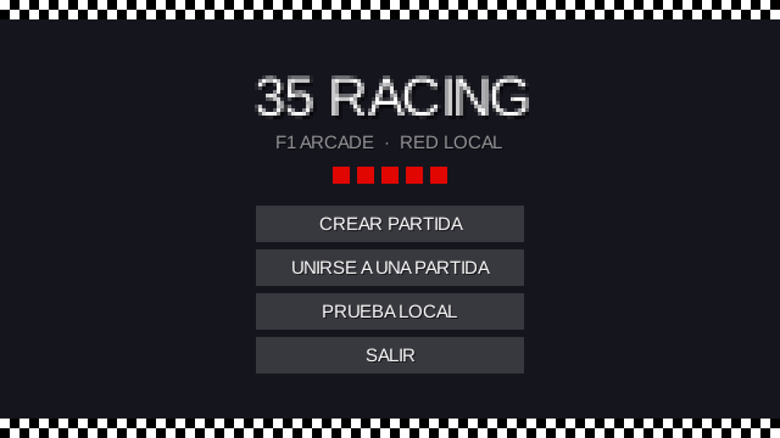
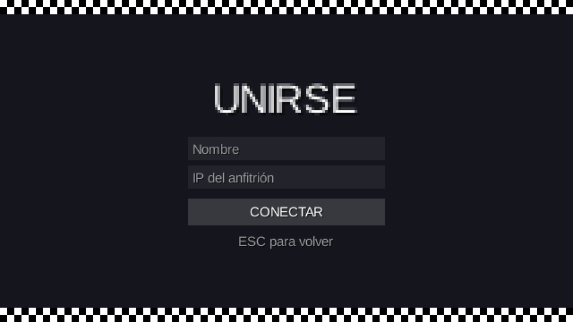
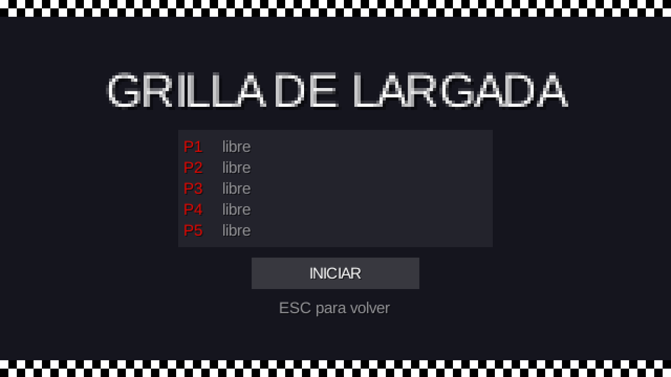
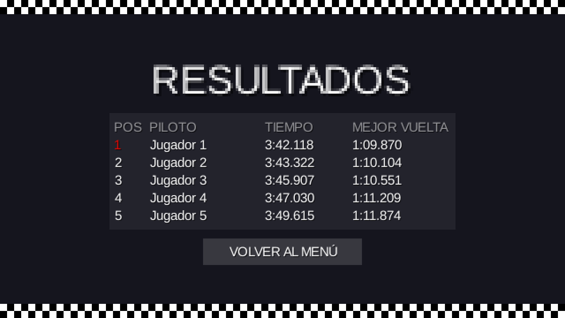

# Etapa 2: Esqueleto y pantallas

## Objetivo

Armar el esqueleto del juego, todavía sin física ni red: cinco pantallas navegables con botones (menú principal, unirse, lobby, carrera y resultados), con ESC para volver, una interfaz hecha con Scene2D y una resolución virtual de 640×360 con estilo pixel art. Además, el grupo pidió que todo el juego tenga una **estética de Fórmula 1**.

## El plan (se mostró y se confirmó antes de programar)

| Clase | Qué hace |
|---|---|
| `util/Config` | Constantes globales (`MAX_JUGADORES = 5`, `VUELTAS = 3`, `TICKS_POR_SEGUNDO = 60`, puertos 7777 y 7778, resolución virtual, ventana inicial) |
| `util/Paleta` | Colores del estilo visual |
| `util/Recursos` | Punto único que crea y libera el `AssetManager`, el `SpriteBatch`, las fuentes y el `Skin` |
| `pantallas/PantallaBase` | Clase base con la escena, el `FitViewport` de 640×360, el manejo de ESC y el marco visual |
| `MenuPrincipal`, `UnirsePartida`, `Lobby`, `Carrera`, `Resultados` | Las cinco pantallas |
| `Main` | Pasa a extender `Game` y decide qué pantalla se muestra |

También se crearon los paquetes `juego`, `vista`, `red`, `pantallas` y `util`, cada uno con un `package-info.java` de una línea que dice qué va ahí.

## Qué se hizo

- **Interfaz sin archivos externos.** El `Skin` se arma por código: la fuente por defecto de libGDX y rectángulos de color como fondos. Para que el pixel art no se vea borroso al escalar se usa filtro *Nearest*.
- **Resolución virtual 640×360** con `FitViewport`. La ventana abre en 1280×720, es redimensionable y no baja de 640×360; al agrandarla, el contenido escala con barras a los costados en lugar de deformarse.
- **Estética de Fórmula 1:** fondo color carbono (`#15151E`), rojo de largada (`#E10600`) y blanco; una bandera de cuadros arriba y abajo de cada pantalla; cinco luces rojas de largada bajo el título del menú; una grilla de largada P1 a P5 en el lobby; y pianos rojo y blanco en el fondo de la carrera.
- **Navegación completa** entre las cinco pantallas, con ESC para volver al menú.

## Decisiones

- **`PantallaBase` compartida.** Las cinco pantallas repiten la misma estructura (escena, ESC, marco). Se resolvió una sola vez en una clase base.
- **Un solo `SpriteBatch`.** Las escenas comparten el de `Recursos` en lugar de crear uno por pantalla, y así se libera en un único lugar.
- **Cambio de pantalla diferido.** `Main.irA(...)` cambia de pantalla con `Gdx.app.postRunnable`. Se llama desde un botón de la pantalla vieja, y destruirla en medio de su propio evento puede fallar.
- **Sin acentos que no existan en la fuente.** Antes de escribir los textos se verificó que la fuente por defecto trae ó, é, ñ, ¡ y Ó, pero no las flechas; por eso no se usan flechas en la interfaz.
- **Botón "Finalizar carrera" provisorio** para poder llegar a Resultados sin lógica de carrera. Se quitó en la etapa 4.

## Verificación

- Compila con Gradle sin errores.
- El juego arrancó y siguió corriendo 25 segundos sin excepciones (se detuvo desde afuera).
- Se sacaron capturas de las pantallas con una ventana oculta.

## Capturas

| Menú principal | Unirse |
|---|---|
|  |  |

| Lobby | Resultados (datos de ejemplo) |
|---|---|
|  |  |

## Commits y pull request

- [`c007aca`](https://github.com/joakinkong/35-Racing/commit/c007aca): Feat: Config, Paleta y Recursos con Skin por código y estilo F1.
- [`76eebb3`](https://github.com/joakinkong/35-Racing/commit/76eebb3): Feat: Esqueleto de pantallas con navegación y ventana 1280x720.
- Pull request [#2](https://github.com/joakinkong/35-Racing/pull/2).

## Una lección de flujo de trabajo

El pull request #2 se hizo directamente contra `main`, en lugar de contra `develop`, y así se salteó la rama de integración. No se rompió nada, pero después se corrigió la práctica: los pull requests de cada etapa van a `develop`, y `develop` pasa a `main` al cerrar un hito (ver etapas siguientes).
