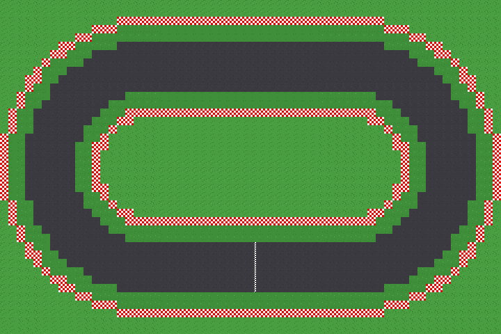
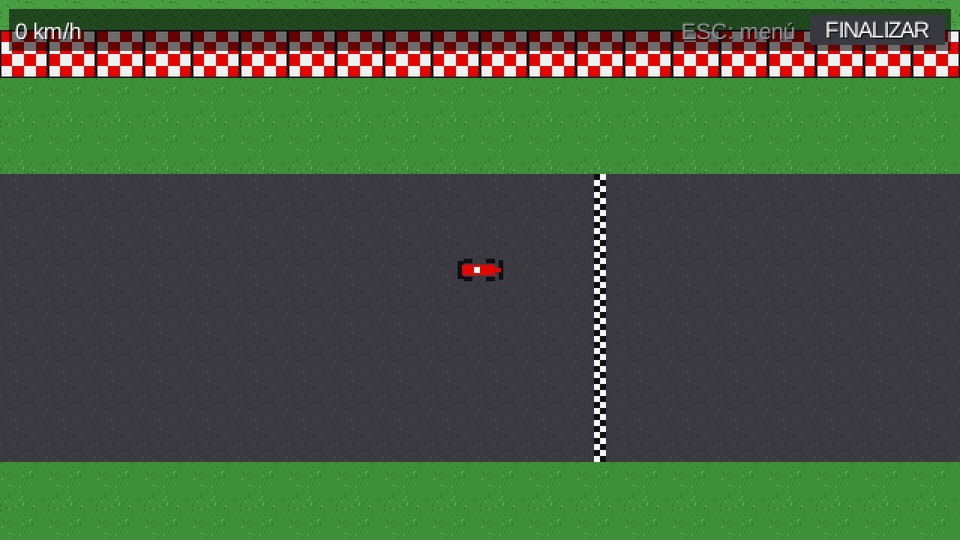

# Etapa 3: Auto y circuito (1 jugador local)

## Objetivo

Un auto manejable en un circuito, con un solo jugador local y sin red: física arcade propia (sin Box2D), circuito cargado desde un mapa de Tiled, cámara que sigue al auto y simulación a paso fijo desacoplada del dibujo.

## El circuito: un requisito que faltaba

La guía indica que la persona de arte arma a mano `assets/circuitos/circuito1.tmx` en Tiled, con tiles de 32×32 y propiedades personalizadas. Ese archivo todavía no existía, y sin él no se podía probar nada. Se propuso y se aprobó generar un **circuito provisorio** con un script, con el mismo formato exacto que pide la guía, para poder seguir sin bloquearse:

- Un óvalo de 60×40 tiles con pista de 6 tiles de ancho, pasto de escape de 2 tiles a cada lado y muros con pianos rojo y blanco.
- Un tileset de 5 tiles en pixel art (pasto, pista, muro, línea de meta y una variante de pasto) generado por código.
- Capa de tiles `suelo` con la propiedad `superficie` (`pista`, `pasto` o `muro`) en cada tile, capa de objetos `checkpoints` (10 rectángulos con `orden`, donde el 0 es la meta), capa `largada` (5 lugares con `posicion`) y la propiedad `anguloLargada` en el mapa.

Cuando arte tenga el circuito definitivo, lo reemplaza sin tocar código mientras respete esas capas y propiedades.

## Qué se hizo

**Modelo (`juego`), sin ninguna clase gráfica** porque después lo usa el servidor:

| Clase | Qué hace |
|---|---|
| `Circuito` | Datos puros: grilla de superficies, checkpoints ordenados, lugares y ángulo de largada; detecta si un círculo choca con un muro |
| `CargadorCircuito` | Convierte el `TiledMap` en un `Circuito` y valida que el mapa tenga todas las capas y propiedades |
| `Superficie` | `PISTA`, `PASTO` o `MURO` |
| `EntradaAuto` | Lo que hace el jugador: acelerar, frenar y girar (-1, 0 o 1) |
| `ParametrosAuto` | Todos los valores de la física en un solo lugar |
| `Auto` | Posición, ángulo y velocidad, con la física arcade |

**Física del auto.** La velocidad se separa en una componente hacia adelante y otra lateral respecto de adonde mira el auto, y la lateral se va perdiendo de a poco: de ahí sale el derrape leve. Tiene aceleración, freno, reversa lenta, velocidad máxima y rozamiento; el giro depende de la velocidad (parado no gira, en reversa gira al revés); en el pasto baja la velocidad máxima y sube el rozamiento; y contra un muro rebota y pierde velocidad sin atravesarlo. La colisión se resuelve un eje por vez, con el auto como círculo.

**Vista (`vista`).** `VistaCircuito` dibuja el mapa, `VistaAuto` dibuja el auto como un monoplaza armado con rectángulos (hasta que haya sprites) y `CamaraSeguimiento` sigue al auto con un leve adelanto hacia donde va.

**Pantalla `Carrera`.** Simulación a paso fijo de 1/60 s con un acumulador, y dibujo que interpola entre el último tick y el siguiente para que el movimiento sea fluido aunque la frecuencia de cuadros varíe. Se maneja con flechas o WASD.

## Decisiones

- **Física propia y sin Box2D:** lo exigen las pautas.
- **Modelo separado de lo gráfico:** `Circuito`, `Auto` y `EntradaAuto` no usan nada de dibujo ni de teclado, para que el servidor pueda simular la carrera.
- **Colisión por eje:** si el auto chocaría al moverse en un eje, ese eje no se mueve y su velocidad rebota con pérdida. Así no atraviesa muros ni se traba.
- **Tope de tiempo por cuadro (0,25 s):** un tirón, por ejemplo al mover la ventana, no dispara cientos de ticks de golpe.

## Problemas encontrados y cómo se resolvieron

1. **En el pasto con el acelerador apretado, el auto se frenaba por completo.** Se detectó al revisar el código antes de correrlo: el rozamiento del pasto (390 px/s²) le ganaba a la aceleración (220 px/s²). Se cambió para que en el pasto con el acelerador la velocidad la limite el máximo permitido y el auto avance despacio.
2. **Marcha atrás imposible en el pasto.** Lo encontró la prueba automática: un auto pegado a un muro, en la zona de pasto, no podía salir marcha atrás, porque el rozamiento por tick (5 px/s) era mayor que la aceleración en reversa por tick (2 px/s). Se corrigió para que el rozamiento solo actúe cuando no se toca ningún pedal.

## Verificación

Se escribió una prueba descartable (no forma parte del repositorio) que abre el juego con la ventana oculta, carga el circuito real y simula autos con entradas guionadas. Resultados:

| Prueba | Resultado |
|---|---|
| El `.tmx` carga | 1920×1280 px, 10 checkpoints, 5 lugares de largada, todos sobre pista y sin tocar muros |
| Acelerar 3 s en recta | Llega a la velocidad máxima de 360 px/s |
| Parado con el giro apretado | El ángulo no cambia |
| Frenar parado | Retrocede, con tope de 90 px/s |
| Pasto acelerando | 162 px/s, que es el 45 % del máximo, como se configuró |
| Chocar de frente 8 s contra un muro | 0 veces dentro del muro; después sale marcha atrás (antes del arreglo, se quedaba trabado) |
| Piloto automático de 2 vueltas | Completa las 2 vueltas (11,7 s y 10,7 s) sin tocar un muro |

También se sacó una captura del auto en la largada.

## Cómo ajustar la sensación de manejo

Solo se toca `ParametrosAuto`: `ACELERACION` y `VELOCIDAD_MAX` (arranque), `GIRO_MAX` y `VELOCIDAD_GIRO_COMPLETO` (giro), `AGARRE` (más alto, menos derrape), `ROZAMIENTO` (cuánto tarda en frenarse solo), `FACTOR_VELOCIDAD_PASTO` y `ROZAMIENTO_PASTO` (pasto), `REBOTE` y `PERDIDA_POR_ROCE` (muros).

## Commits y pull request

- [`9df7882`](https://github.com/joakinkong/35-Racing/commit/9df7882): Feat: Circuito provisorio circuito1.tmx con tileset en pixel art.
- [`5fb156e`](https://github.com/joakinkong/35-Racing/commit/5fb156e): Feat: Modelo del auto y del circuito con física arcade.
- [`80d0f95`](https://github.com/joakinkong/35-Racing/commit/80d0f95): Feat: Carrera con un auto manejable, cámara y HUD.
- Pull request [#3](https://github.com/joakinkong/35-Racing/pull/3), esta vez sí hacia `develop`.
