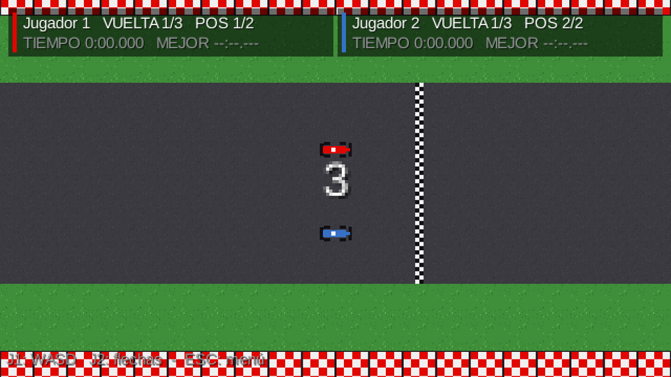
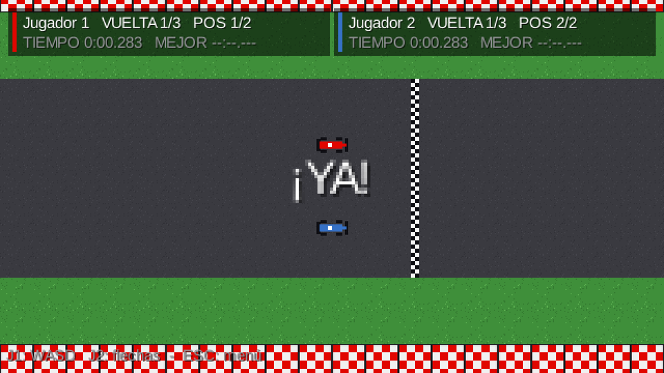
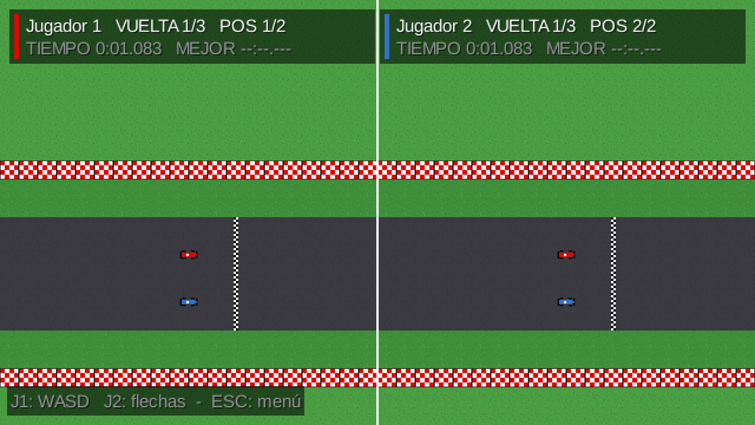
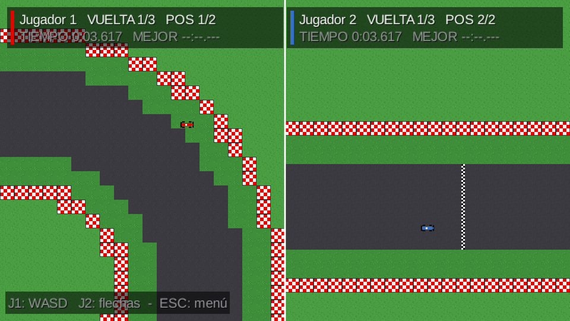
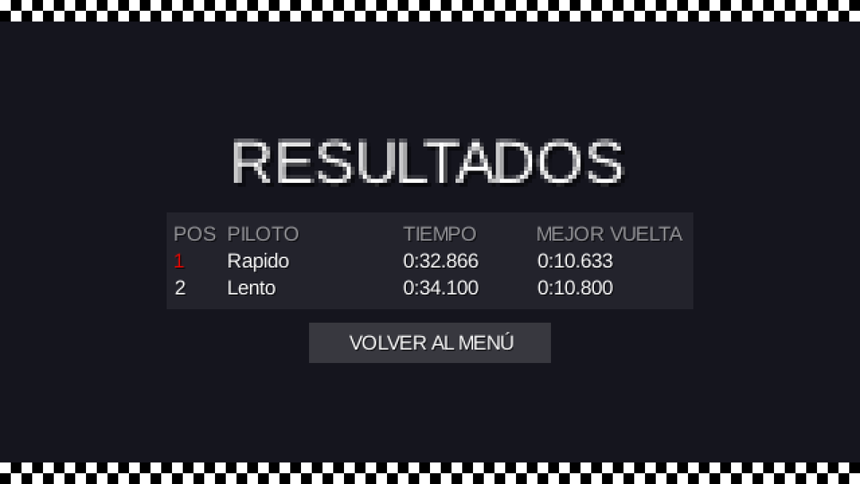

# Etapa 4: Reglas de carrera y dos autos locales

## Objetivo

Sumar las reglas de una carrera completa, todavía sin red: cuenta regresiva, vueltas validadas por checkpoints, posiciones, choques entre autos, fin de carrera y resultados. Es el paso de la propuesta en que "se incorporará el segundo vehículo controlado localmente para probar la lógica de colisiones y vueltas".

## El plan (se mostró y se confirmó antes de programar)

Además de las reglas, el plan proponía tres decisiones que el grupo confirmó: renombrar la pantalla `Carrera` a `PantallaCarrera` (para no chocar con el modelo `juego.Carrera`), que "Prueba local" sea de 2 jugadores en el mismo teclado (J1 con WASD y J2 con flechas) y usar los nombres provisorios "Jugador 1" y "Jugador 2".

## Qué se hizo

**Modelo (`juego`), sin clases gráficas.** `Carrera` recibe las entradas de cada auto por identificador (`Map<Integer, EntradaAuto>`) y avanza un paso de simulación. Es la clase que más adelante va a correr en el servidor, así que no lee el teclado. Sus reglas:

- **Estados:** `CUENTA_REGRESIVA`, `EN_CURSO` y `TERMINADA`. La cuenta dura 3 segundos y hasta el "¡YA!" las entradas se ignoran y los autos no se mueven.
- **Vueltas:** el auto sale detrás de la meta y tiene que pasar por los checkpoints en orden y cruzar la meta. Se mide el tiempo de cada vuelta, la mejor vuelta y el tiempo total.
- **Posiciones:** primero los que terminaron, por tiempo; después, por vueltas completadas, por checkpoint alcanzado y por distancia al próximo checkpoint.
- **Fin:** cuando el primero completa las 3 vueltas, el resto tiene 30 segundos para terminar. Pasado ese tiempo, o si todos terminaron antes, la carrera pasa a `TERMINADA`.
- **Choques entre autos:** dos círculos de igual masa que se separan por el solapamiento (si un muro le impide moverse a uno, el otro absorbe lo que falta) y se reparten la velocidad con un rebote parcial.

Clases nuevas: `Carrera`, `EstadoCarrera`, `Participante` y `ResultadoJugador`.

**Pantalla y vista.** `PantallaCarrera` maneja 1 o 2 jugadores locales, con un panel de HUD por jugador (vuelta, posición, tiempo actual y mejor vuelta, con una franja del color de su auto), un cartel grande para la cuenta regresiva y el "¡YA!", y el pase automático a Resultados 2,5 segundos después de terminar. `Resultados` muestra datos reales. Se agregaron `Tiempo` (formato `m:ss.mmm`) y una paleta con un color por auto.

## Decisiones

- **`Carrera` pensada para el servidor:** sin teclado, sin dibujo y con las entradas por identificador, porque va a ser lo que simule el servidor autoritativo cuando llegue la red.
- **Un auto que terminó deja de recibir entradas** y se va frenando solo.
- **Los que no terminan** quedan ordenados por avance y su tiempo total se muestra con guiones.

## Problemas encontrados y cómo se resolvieron

La verificación y el uso real encontraron varios problemas. Estos son los más importantes, en el orden en que aparecieron:

1. **Manejar en contramano avanzaba checkpoints** (encontrado revisando la regla). Con la condición "cruzar el checkpoint hacia adelante", un auto que recorre la pista al revés igualmente sumaba un checkpoint por vuelta. Se agregó una segunda condición: además de ir hacia adelante, el auto tiene que avanzar en el sentido de la pista en ese checkpoint (calculado desde la geometría del circuito).
2. **La primera prueba de contramano no probaba nada.** Reportó 0 checkpoints cruzados, porque el piloto automático de prueba no podía dar la vuelta estando parado (un auto parado no gira). Se corrigió la prueba, y con la versión correcta cruzó más de 80 checkpoints al revés sin sumar una sola vuelta.
3. **Los checkpoints solo cubrían la pista** (observación del grupo al jugar). Un auto que se salía al pasto de escape se los salteaba y no sumaba vueltas, aunque ir por el pasto ya es una desventaja porque el auto va más lento. Se regeneró el circuito con checkpoints de muro a muro. Prueba: un piloto que fue el 72 % del tiempo por el pasto completó 2 vueltas en 46,6 s, contra unos 21 s por la pista. Cuentan, pero siguen siendo más lentas.
4. **La cámara perdía de vista al segundo jugador** (observación del grupo al jugar). Con una cámara compartida, cuando los autos se separaban mucho la cámara seguía solo al que iba primero y el otro quedaba fuera de pantalla. Se probaron dos soluciones, y la segunda la pidió el grupo:
   - Primero, pantalla dividida solo cuando los autos no entraban juntos.
   - Después, por pedido del grupo, algo más simple: cada jugador tiene su propia cámara con zoom fijo de 2× y la pantalla queda siempre dividida, sin unirse ni separarse. Se eliminó bastante código: el commit quita 134 líneas y suma 38.
5. **Una captura rara que no era un error del juego.** Al probar la pantalla dividida, un auto aparecía descentrado. La causa era la propia prueba, que movía el auto de lugar durante la cuenta regresiva, cuando el auto no se actualiza; se repitió la prueba moviéndolo con la carrera en curso y quedó centrado. Sirvió para separar un artefacto de la prueba de un error real.
6. **El texto de ayuda del HUD** se perdía sobre los pianos del mapa: se le agregó un fondo, como al resto del HUD.

## Verificación

Con la misma técnica de la etapa 3 (prueba descartable con ventana oculta), sobre el circuito real:

| Prueba | Resultado |
|---|---|
| Cuenta regresiva con el acelerador apretado | Dura 3,02 s y el auto se movió 0 px |
| Sumar un auto con la carrera empezada | Se rechaza |
| Dos pilotos automáticos, 3 vueltas | Terminan en 32,866 s y 34,100 s, en el orden correcto |
| Contramano durante 90 s | 83 checkpoints cruzados al revés, 0 vueltas |
| Choque por atrás | Distancia mínima entre autos de 20 (igual a 2 radios: no se solapan ni se traban) |
| Cierre de la carrera | 30,02 s después de que termina el primero (se pidieron 30) |
| El que no terminó | Aparece en resultados sin tiempo total |
| Vueltas por el pasto | 2 vueltas completas, 46,6 s |

## Capturas

| Cuenta regresiva | "¡YA!" |
|---|---|
|  |  |

| Pantalla dividida, autos juntos | Pantalla dividida, autos lejos |
|---|---|
|  |  |

*Los nombres "Rapido" y "Lento" de la última captura son de la prueba con pilotos automáticos; en el juego los autos se llaman "Jugador 1" y "Jugador 2".*

## Commits y pull requests

- [`a547b09`](https://github.com/joakinkong/35-Racing/commit/a547b09): Feat: Reglas de carrera en el modelo (cuenta, vueltas, posiciones y choques).
- [`3565910`](https://github.com/joakinkong/35-Racing/commit/3565910): Feat: Prueba local a 2 jugadores con HUD, cámara y resultados reales.
- [`d05a5b0`](https://github.com/joakinkong/35-Racing/commit/d05a5b0): Fix: Checkpoints de muro a muro para que cuenten también por el pasto.
- [`71deaca`](https://github.com/joakinkong/35-Racing/commit/71deaca): Fix: Pantalla dividida en la prueba local cuando los autos no entran juntos.
- [`23a261b`](https://github.com/joakinkong/35-Racing/commit/23a261b): Fix: Zoom fijo en 2x en pantalla dividida para que el corte no cambie la escala.
- [`4f385f1`](https://github.com/joakinkong/35-Racing/commit/4f385f1): Refactor: Una cámara por jugador con zoom fijo 2x, sin unir ni separar pantallas.
- [`c0b9567`](https://github.com/joakinkong/35-Racing/commit/c0b9567): Docs: Línea en blanco antes de la entrada 0.1.0 del CHANGELOG.
- Pull request [#4](https://github.com/joakinkong/35-Racing/pull/4): rama de trabajo a `develop`.
- Pull request [#5](https://github.com/joakinkong/35-Racing/pull/5): `develop` a `main`, con todo lo de las etapas 3 y 4.
