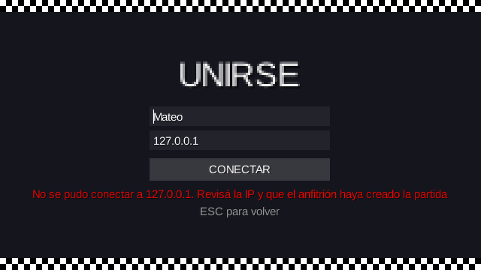
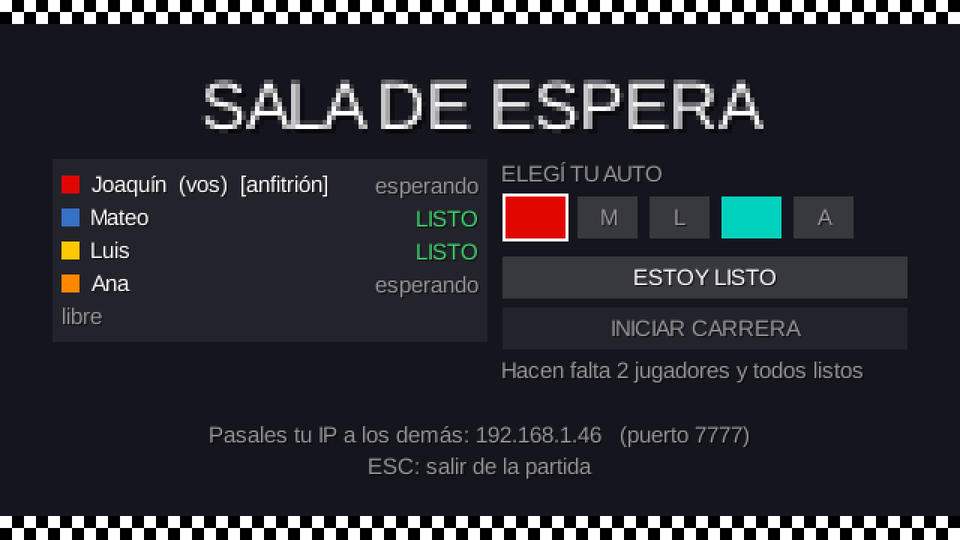
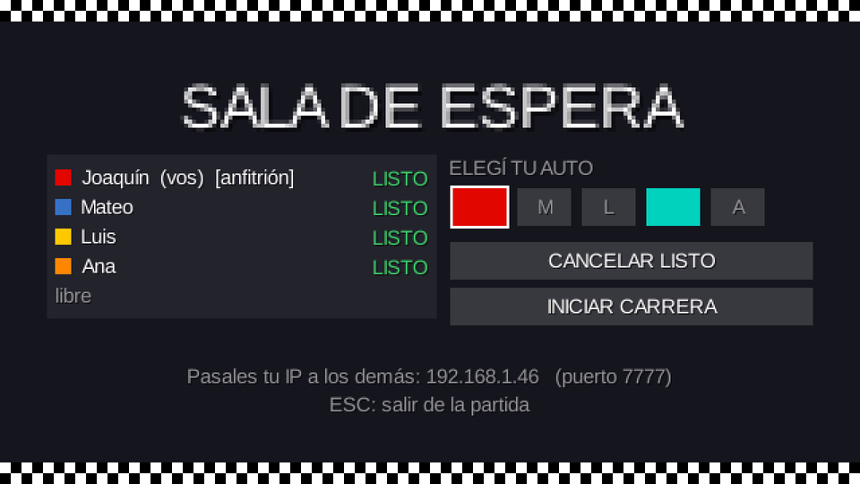
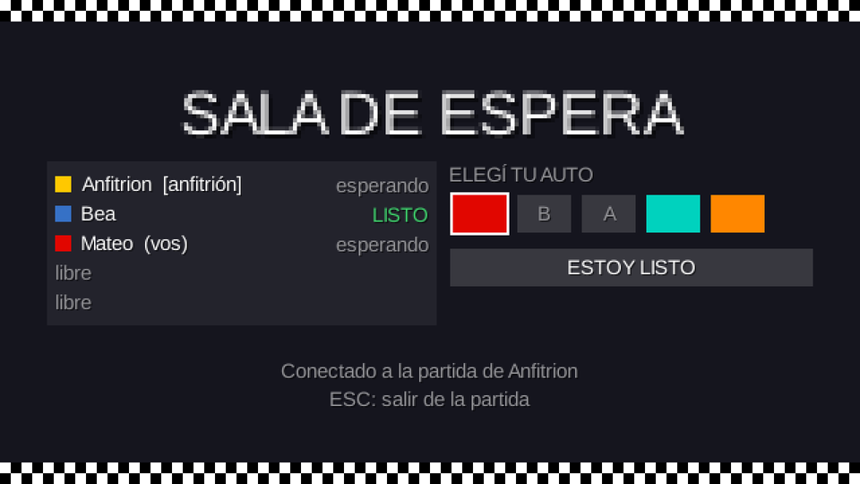

# Etapa 6: Conexión y lobby por TCP

## Objetivo

Implementar la primera parte del protocolo de red ([docs/PROTOCOLO.md](../PROTOCOLO.md), secciones 1, 2, 3, 7 y 8): que una PC cree una partida, que otras se unan por IP, y que todos vean en vivo el lobby, elijan auto, marquen "listo" y el host inicie. Todavía sin UDP y sin carrera sincronizada: al iniciar, cada uno corre su propia carrera local.

## El plan (se mostró y se confirmó antes de programar)

El grupo confirmó tres decisiones que el plan proponía:

1. **"Crear partida" pide el nombre.** La guía no lo decía, pero el host necesita uno para aparecer en el lobby.
2. **`INICIAR` exige al menos 2 jugadores,** como dice el protocolo (`Config.MIN_JUGADORES`). Para probar solo hace falta abrir 2 instancias.
3. **Al iniciar, cada cliente corre su propia carrera local** con su nombre y su color, hasta que en la etapa siguiente se sincronice.

## Qué se hizo

**Paquete `red` (Java puro, sin LibGDX):**

| Clase | Qué hace |
|---|---|
| `Protocolo` | Nombres de mensajes y de errores como constantes; arma y lee las líneas (`;`, UTF-8); valida el nombre (solo letras, números y espacios, de 1 a 12 caracteres) |
| `ConexionTcp` | Un `Socket` con mensajes por línea: escritura sincronizada con `flush`, `setTcpNoDelay(true)`, timeout de lectura de 6 s |
| `servidor/ServidorPartida` | `ServerSocket` en el puerto 7777 con tres tipos de hilos: uno que acepta, uno lector por cliente y uno de lógica |
| `cliente/ClientePartida` | Se conecta en segundo plano (timeout de 3 s), lee en otro hilo y deja los mensajes en una cola thread-safe; manda un `PING` cada 2 s |
| `EstadoLobby` | La foto del lobby (quién es el host y, por jugador, id, nombre, auto y si está listo), que sabe armarse y leerse como mensaje `LOBBY` |
| `SesionRed` | Lo que una PC tiene abierto: su cliente y, si es el host, también el servidor |
| `DireccionesLocales` | Las IPv4 de la red local de esta PC (sin las de máquinas virtuales), para mostrarlas en el lobby del host |
| `RegistroRed` | Log en consola de cada mensaje enviado y recibido, controlado por `Config.DEBUG_RED` |

**Lo que implementa el servidor:** `UNIRSE` con las cinco validaciones de error (versión, carrera empezada, partida llena, nombre inválido y nombre repetido), `ELEGIR_AUTO` sin repetir, `LISTO`, `INICIAR` (solo el host y con todos listos), `SALIR`, `PING`/`PONG`, las caídas de un cliente (se libera su lugar y se avisa) y el cierre del host (`CERRADA` para todos). Al iniciar manda `CUENTA_REGRESIVA` y, a los 3 s, `LARGADA`; desde ese momento rechaza a quien quiera entrar.

**Pantallas:**
- **Crear partida:** pide el nombre, levanta el servidor y se conecta a `127.0.0.1`. Si el puerto 7777 está ocupado, muestra el error.
- **Unirse:** nombre e IP. Muestra "Conectando..." y, si falla, un mensaje claro (no se pudo conectar, partida llena, versión distinta, nombre repetido...).
- **Lobby en vivo:** los 5 lugares con su color, nombre y estado; cinco cuadros de color para elegir auto (los que tomó otro jugador quedan deshabilitados y muestran su inicial); botón "Estoy listo"; y, solo para el host, "Iniciar carrera" (deshabilitado hasta que haya 2 jugadores y todos estén listos) más sus IPs de la red para dictárselas al resto.
- **Al iniciar:** todos pasan a la carrera con el nombre y el color elegidos. Si se corta la conexión o el host cierra la partida, vuelven al menú con un aviso.

## Decisiones

- **Un solo hilo toca el estado de la partida** (el de lógica del servidor). Los hilos lectores le dejan eventos en una `LinkedBlockingQueue` y él los procesa en orden, así no hacen falta `synchronized` sobre los jugadores. La única excepción es el `PING`, que el lector contesta en el momento porque no toca ningún estado.
- **En el cliente, la red nunca toca LibGDX.** El hilo de red solo encola mensajes; cada pantalla los procesa al principio de su `render()`. Para eso se agregó a `PantallaBase` un gancho `actualizar(delta)`.
- **El host es el primer jugador que se une.** Es el que crea la partida y se conecta a su propio servidor de inmediato. Se aclaró en el protocolo.
- **No se activa `SO_REUSEADDR` en el servidor.** En Windows permitiría que otro programa abra el mismo puerto; sin eso, una segunda partida en la misma PC falla con un error claro en lugar de quedar rota.
- **Los mensajes de la red se traducen a un `Mensaje`.** El cliente también genera dos mensajes propios (`_CONEXION_FALLIDA` y `_CONEXION_PERDIDA`, con un guion bajo para no confundirse con los del protocolo), así las pantallas tratan igual lo que llega de la red y las fallas locales.
- **La conexión se mantiene viva también en la carrera y en los resultados.** Si esas pantallas no mandaran `PING`, el servidor daría de baja al jugador a los 6 s. Se verificó (ver abajo).

## Problemas encontrados y cómo se resolvieron

1. **La primera corrida de la prueba dio un fallo, que era un error de la prueba y no del servidor.** El servidor había aceptado el cambio de auto y difundido el lobby correcto (se comprobó en el log). La prueba leyó por error un mensaje `LOBBY` viejo que todavía estaba en la cola del cliente, que es una cola en orden de llegada. Se corrigió la prueba para que espere a que se vea el cambio.
2. **"Conectado a la partida de ?".** Al mirar la captura del lobby de un invitado, el texto con el nombre del host se calculaba antes de que llegara el primer `LOBBY`. Se cambió para que se actualice cada vez que cambia el lobby.
3. **Un mensaje de error largo se salía del borde** de la pantalla en el formulario de unirse; se acortó.
4. **Una decisión que evitó un error futuro:** al iniciar, cada cliente corre una carrera local que dura unos 35 segundos y la sesión seguía abierta; sin `PING` en esas pantallas, el servidor habría dado de baja a todos a los 6 segundos. Por eso `PantallaCarrera` y `Resultados` también atienden la red.

## Verificación

**Capa de red, con un servidor real y clientes falsos** (una prueba descartable, sin pantalla). 40 comprobaciones, todas correctas:

| Grupo | Qué se comprobó |
|---|---|
| Lobby | El host recibe el id 0 y se lo marca como host; un nombre con tilde (`Joaquín`) llega bien por UTF-8; el segundo jugador recibe el id 1 y un auto distinto |
| Errores de `UNIRSE` | Nombre repetido (sin distinguir mayúsculas), nombre con un símbolo, nombre de 13 caracteres, versión distinta, partida llena (el sexto jugador) y carrera ya empezada, todos con su código de error; el servidor cierra la conexión después de rechazar |
| Autos | Cada jugador recibe un auto distinto; elegir el auto de otro da `AUTO_OCUPADO`; un auto que se liberó se puede elegir |
| Inicio | `INICIAR` de alguien que no es host da `NO_PERMITIDO`; con jugadores sin marcar da `FALTAN_JUGADORES`; con un solo jugador tampoco deja iniciar; con todos listos, todos reciben `CUENTA_REGRESIVA`, y la `LARGADA` llega a los **3.009 ms** |
| Durante la carrera | Un jugador que sale genera `SALIO` para los demás; elegir auto da `NO_PERMITIDO` |
| Cierre | Cuando el host sale, todos reciben `CERRADA` y después ven la conexión cerrada; si el host cierra con `SALIR`, pasa lo mismo |
| Caídas | Un cliente que se corta sin avisar libera su lugar en el lobby; un cliente **mudo** se da de baja a los **6.044 ms** (el timeout es 6.000); los que mandan `PING` siguen conectados después de 9 s |
| Robustez | Líneas vacías, mensajes desconocidos, campos vacíos, un `LOBBY` mandado por un cliente y un `UNIRSE` sin campos: el servidor no se cae y sigue contestando el `PING` |
| Fallas de conexión | Un puerto cerrado da `CONEXION_FALLIDA` en 12 ms; una IP que no responde, en 2.862 ms (el timeout es 3.000); un puerto ocupado lanza `BindException` |
| Formato | El ejemplo de mensaje `LOBBY` del protocolo se lee bien y armar y leer es reversible |

**Interfaz de punta a punta,** con la ventana oculta, usando el flujo real y tres jugadores falsos que se conectan al servidor del host: el menú muestra el aviso; unirse a un puerto vacío muestra el error; un nombre inválido muestra su mensaje; "Crear" lleva al lobby con el host; entran 3 jugadores; el host marca listo y el botón de iniciar se habilita; al iniciar pasa a la carrera; **a los 7,8 s de carrera sigue conectado** (el `PING` funciona); un jugador sale y el host sigue en la carrera; al volver al menú con ESC, los demás reciben `CERRADA`; y un invitado ve el lobby y sale con ESC.

## Capturas

| Formulario de unirse con un error | Lobby del anfitrión |
|---|---|
|  |  |

| Todos listos: se habilita "Iniciar" | Lobby de un invitado |
|---|---|
|  |  |

## Cómo probarlo

**Tres instancias en la misma PC** (Eclipse, `Lwjgl3Launcher`, Run As, tres veces):
1. En la primera: "Crear partida", con un nombre.
2. En la segunda y la tercera: "Unirse a una partida", con otro nombre cada una y la IP `127.0.0.1`.
3. En las tres: elegir un auto y "Estoy listo". En la primera, "Iniciar carrera".
4. Con la consola de Eclipse se ve el log de cada mensaje (`Config.DEBUG_RED`).

**Dos PC:** la PC del host muestra en el lobby su IP de la red (por ejemplo `192.168.1.46`); la otra la escribe en "Unirse". Si no conecta, revisar el firewall de Windows de la PC del host (tiene que permitir Java en redes privadas, o el puerto TCP 7777) y que la red del colegio no aísle a los equipos entre sí. Desde la otra PC se puede comprobar con `Test-NetConnection 192.168.1.46 -Port 7777` en PowerShell. La guía recomienda probar cuanto antes en las PC del colegio: si la red bloquea algo, mejor enterarse ahora.

## Commits

- Los commits de la etapa están en la rama `feature/lobby-tcp`.
