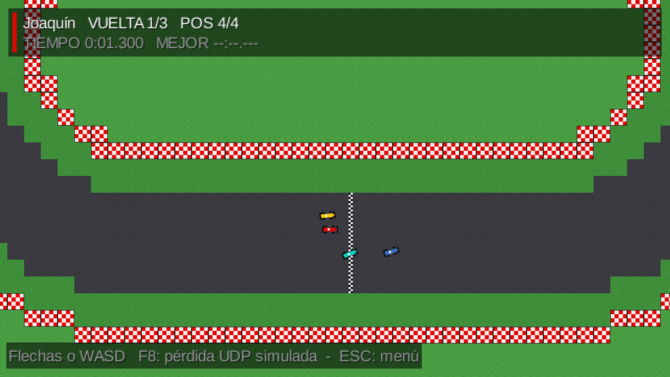
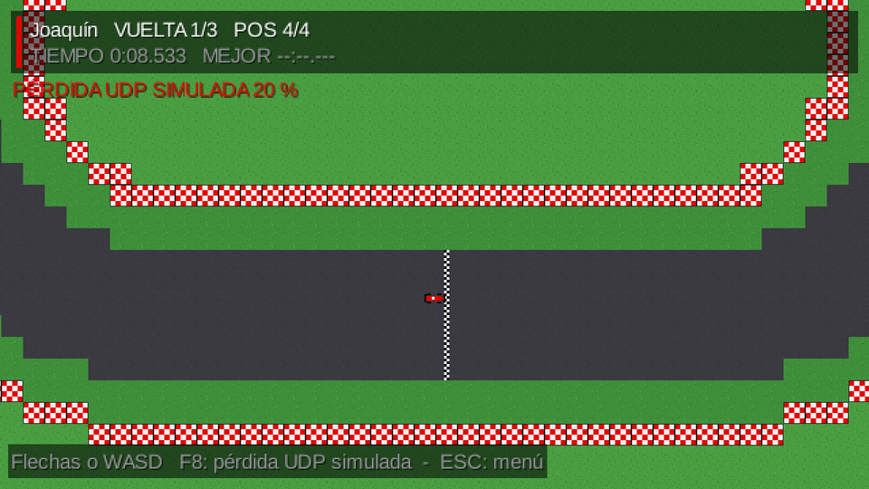
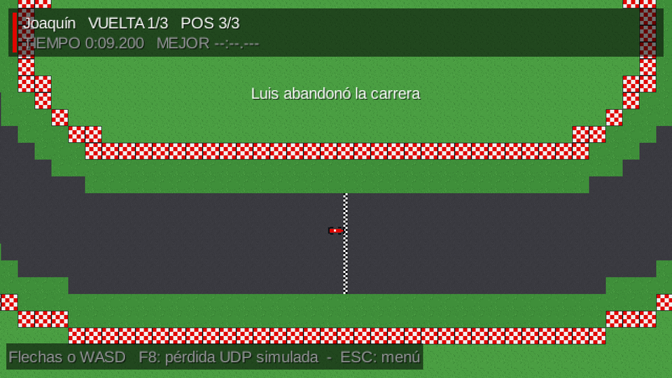
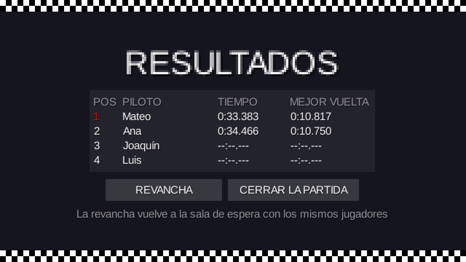
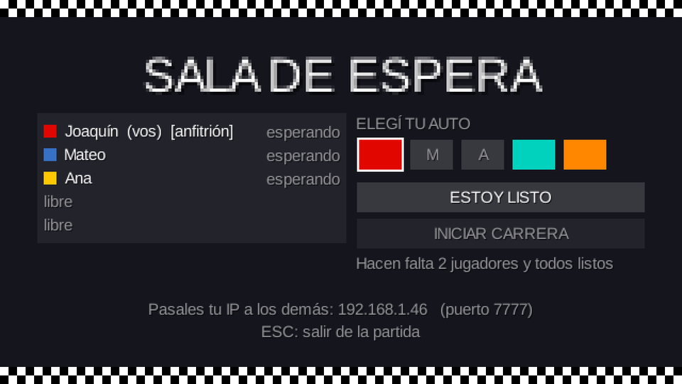
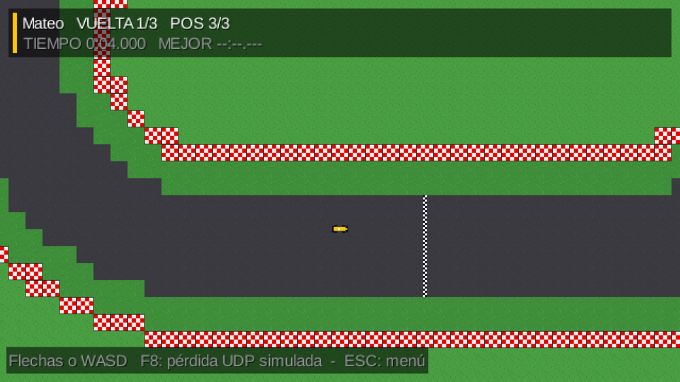

# Etapa 7: Carrera sincronizada por UDP

## Objetivo

Que la carrera se juegue en red de verdad, según [docs/PROTOCOLO.md](../PROTOCOLO.md) (secciones 4 a 8). La simula solo el servidor, con la última entrada recibida de cada jugador, y manda el estado de todos los autos por UDP. Los clientes mandan lo que aprieta cada jugador y dibujan lo que llega, interpolado. Al terminar vienen los resultados por TCP y la opción de revancha, y la prueba local tiene que seguir andando sin red. La guía la marca como "la parte que define si se aprueba la materia". Se usó Claude Opus 5.5, como recomienda la guía.

## El plan (se mostró y se confirmó antes de programar)

La idea central fue que **una sola pantalla de carrera dibuje "fotos" de la carrera sin importar de dónde vengan**: de una simulación local o del servidor. El grupo confirmó tres puntos:

1. **Resultados y revancha:** solo el host puede pedir la revancha, y si el host vuelve al menú se cierra la partida para todos.
2. **Una desviación del protocolo:** el color de cada auto lo resuelve la pantalla con el lobby (id del jugador → auto elegido), en lugar de guardarlo en el modelo. El protocolo se actualizó con esta decisión.
3. **Un extra para la demo:** la tecla F8 cambia en vivo la pérdida de paquetes simulada (0 %, 20 %, 50 %), para mostrar sin recompilar que el juego la tolera.

## Qué se hizo

**Clases nuevas:**

| Clase | Qué hace |
|---|---|
| `juego/FotoCarrera`, `juego/FotoAuto` | La carrera en un instante: estado, reloj (negativo en la cuenta regresiva), cierre y, por auto, posición, ángulo, vueltas, posición en carrera y tiempos. Es lo mismo que viaja en el `ESTADO` |
| `juego/FuenteCarrera` | Lo que consume la pantalla: avanzar con las teclas, devolver la foto, los resultados y el nombre y color de cada id |
| `juego/SimulacionLocal` | La prueba local de antes (la carrera simulada en la PC, a paso fijo) |
| `red/PaquetesUdp` | Arma y lee `ENTRADA` (11 bytes) y `ESTADO` (132 bytes con 5 autos) con `ByteBuffer`, byte por byte como en el protocolo |
| `red/PerdidaSimulada` | Descarta al azar la fracción de paquetes UDP que indique `Config.PERDIDA_UDP_SIMULADA` (o F8) |
| `red/cliente/Interpolador` | Búfer de estados, descarte de atrasados y duplicados, reloj estimado del servidor y foto interpolada 100 ms en el pasado |
| `red/cliente/CarreraEnRed` | La carrera vista desde un cliente: manda `ENTRADA` 60 veces por segundo y pasa los `ESTADO` al interpolador |

**Cambios en lo que ya existía:**
- **`ServidorPartida`:**
  - Suma un socket UDP en el puerto 7778 y un hilo receptor que valida cada `ENTRADA` (tamaño, tipo, id, token y secuencia), guarda la última de cada jugador y aprende su dirección.
  - Su hilo de lógica pasó a ser un ciclo de **60 ticks por segundo**, que simula la `Carrera` y manda el `ESTADO` a todos uno de cada dos ticks. También avisa por TCP la `LARGADA` y los `RESULTADOS`, y atiende la `REVANCHA`.
  - La cuenta regresiva ahora la lleva la `Carrera` y no un temporizador aparte.
  - Recibe el `Circuito` ya cargado, porque el mapa de Tiled solo se puede cargar en el hilo de render.
- **`ClientePartida`:** abre su socket UDP en un puerto libre al recibir la `BIENVENIDA`, con un hilo que acepta solo los `ESTADO` que vienen de la dirección del servidor.
- **`Carrera`:** suma la foto, el reloj con decimales y `marcarDesconectado`. El auto del que se fue no se simula, no choca, no se dibuja, no cuenta para "todos terminaron" y queda último si no había terminado.
- **`PantallaCarrera`:** lee el teclado, se lo pasa a la fuente y dibuja la foto. Hay dos formas de crearla: local (2 jugadores con pantalla dividida) y en red (1 jugador y su cámara). En red también atiende lo que llega por TCP: resultados, abandonos, revancha y cierre.
- **`VistaAuto` y `CamaraSeguimiento`:** reciben datos simples (posición, ángulo, velocidad) en lugar de un `Auto` con física, que el cliente en red no tiene.
- **`Resultados`:** en red, el host ve "Revancha" y "Cerrar la partida" y los demás esperan su decisión.
- **`Lobby`:** con `CUENTA_REGRESIVA` abre la carrera en red; desaparece la carrera local temporal de la etapa 6.

## Recorrido de una tecla

Qué pasa desde que un jugador aprieta el acelerador hasta que su auto se mueve en la pantalla de otro:

1. **Teclado (cliente A, hilo de render).** `PantallaCarrera` lee las teclas en cada cuadro y arma una `EntradaAuto` (acelerar, frenar, giro).
2. **Envío (cliente A).** `CarreraEnRed` la manda 60 veces por segundo: `PaquetesUdp` la convierte en un `ENTRADA` de 11 bytes, con el id, el token de la bienvenida, una secuencia que sube de a uno y los botones como bits. Sale por UDP al puerto 7778 del host.
3. **Recepción (servidor, hilo receptor UDP).** El servidor valida el paquete y descarta el que tenga el token equivocado o una secuencia menor o igual a la última. Si es bueno, guarda los botones como "última entrada" de ese jugador (un campo `volatile`) y anota de qué dirección vino.
4. **Simulación (servidor, hilo de simulación).** En el próximo tick (cada 16,7 ms) arma el mapa de entradas con la última de cada jugador y llama a `carrera.actualizar(entradas, 1/60)`. El auto de A acelera: esa es la única carrera que existe de verdad.
5. **Estado (servidor).** Uno de cada dos ticks, `PaquetesUdp` arma un `ESTADO` con todos los autos (132 bytes con 5) y lo manda a la dirección que cada jugador usó para escribirle.
6. **Recepción (cliente B, hilo receptor UDP).** Acepta el paquete solo si viene del servidor, lo lee y lo deja en una cola thread-safe.
7. **Interpolación (cliente B, hilo de render).** Al principio del cuadro, `CarreraEnRed` vacía la cola en el `Interpolador`, que descarta los estados viejos o repetidos por su tick. La pantalla le pide la foto del momento "ahora menos 100 ms" y el interpolador calcula un punto entre los dos estados que rodean ese momento.
8. **Dibujo (cliente B).** `PantallaCarrera` dibuja cada auto de la foto con `VistaAuto`: el de A aparece moviéndose.

Medido de punta a punta, del paso 1 al 8 pasan **unos 97 ms** (ver "Verificación").

## Decisiones

- **Una sola pantalla para la prueba local y para la red.** Separar "de dónde sale la foto" de "cómo se dibuja" evitó tener dos pantallas casi iguales, y es lo que garantiza que la prueba local siga andando.
- **El servidor programa los ticks sobre un horario fijo.** Si el sistema operativo despierta al hilo un poco tarde, el siguiente tick se adelanta, y el promedio queda en 60 por segundo. Mientras espera, procesa los mensajes TCP que lleguen.
- **La entrada se manda como estado, no como evento.** Perder una `ENTRADA` no importa: la siguiente, 17 ms después, trae los mismos botones.
- **El cliente solo acepta `ESTADO` de la dirección del servidor,** y el servidor solo acepta `ENTRADA` con el token correcto. Un paquete de otra partida o de una conexión anterior no se confunde con uno válido.
- **Se mantuvo 30 estados por segundo con 100 ms de retraso de dibujo,** porque la demora medida (97 ms) resultó menor que la estimada (135 ms).

## Problemas encontrados y cómo se resolvieron

1. **Cuatro comprobaciones del interpolador fallaron, pero por un error de la prueba.** La prueba agregaba estados seguidos sin dejar pasar el tiempo entre uno y otro. El interpolador corrige su reloj de a poco (un 10 % por estado) para no dar saltos con la variación normal de la red, así que se quedaba atrás. En el juego real el tiempo pasa entre estado y estado; con la prueba corregida, las 4 dieron bien.
2. **La primera medición de la demora (159 ms) estaba inflada por la física.** Se esperaba que el auto se corriera 0,5 px, y un auto que arranca de parado tarda unos 67 ms de pura física en recorrer eso. Se separó la medición: la demora de la red se mide con el primer cambio de posición (unos 97 ms), y aparte se mide cuándo el auto se corre 1 px en pantalla (unos 185 ms, contra 100 ms de la física sola sin red).
3. **El aviso "X abandonó la carrera" tapaba el auto propio,** porque salía en el centro de la pantalla, que es donde la cámara pone al auto. Se movió arriba, debajo del HUD.
4. **Un detalle de la prueba, no del juego:** en la prueba con interfaz, el auto del host queda quieto porque nadie aprieta las teclas de esa ventana. Por eso la carrera terminó por el cierre de 30 s. Sirvió para comprobar que el cierre y "no terminó" funcionan en red.

## Verificación

**Paquetes e interpolador** (sin red):
- `ENTRADA` mide 11 bytes y `ESTADO` con 5 autos mide 132, y los dos se leen igual a como se armaron.
- Un paquete dañado o de otro tipo se rechaza.
- El interpolador:
  - calcula el punto medio entre dos estados;
  - estima la velocidad;
  - gira por el camino corto (de 350° a 10° pasa por 0°);
  - descarta duplicados y atrasados;
  - se queda en el último estado si dejan de llegar, sin extrapolar;
  - corrige de golpe un salto grande de reloj.

**Carrera real por UDP**, con un servidor y tres clientes en la misma PC. Cada cliente maneja con un piloto automático que mira su propia foto interpolada, igual que un jugador mira su pantalla. Las 43 comprobaciones dieron bien:

| Qué | Resultado |
|---|---|
| Cuenta regresiva | Llegan estados con los autos en la grilla; el host está en el lugar 1; acelerar no mueve el auto hasta la largada |
| Demora de la red (6 mediciones) | 90 a 104 ms, **unos 97 ms en promedio**, en la pantalla de otro jugador y en la propia |
| Frecuencia | **30,0 estados por segundo**, sin ninguno descartado por secuencia (en la misma PC no se desordenan) |
| Token falso | 60 `ENTRADA` con el token equivocado: el auto no se mueve |
| Secuencia vieja | 60 `ENTRADA` con el token correcto pero secuencia vieja: se descartan |
| `ESTADO` falso | 20 paquetes desde otra dirección con los autos en otra posición: el cliente los descarta todos |
| Abandono en carrera | Los demás reciben `SALIO`, el auto figura como desconectado y queda último sin tiempo total |
| Fin | Los dos que siguen terminan (47,5 y 47,8 s) y los dos clientes reciben exactamente los mismos resultados |
| Revancha | Solo la puede pedir el host; vuelven al lobby 2 jugadores, sin el que abandonó y sin nadie listo |
| **Con 20 % de pérdida simulada** | La segunda carrera se completa (33,4 y 34,0 s); llegan 23,9 estados por segundo en vez de 30, y el juego sigue andando |
| Cierre | Cuando el host se va, el otro jugador se entera |

**Interfaz de punta a punta,** con la ventana oculta, en tres escenarios:
1. **La pantalla del host con 3 jugadores de prueba:** cuenta regresiva, largada, el indicador de pérdida al 20 %, el aviso de abandono, los resultados, la revancha y la vuelta al lobby. Al cerrar la partida, los demás se enteran.
2. **La pantalla de un invitado** que se une a la partida de otro: recibió 210 estados en los primeros segundos y, cuando el anfitrión se fue, volvió al menú con el aviso.
3. **La prueba local** con 2 jugadores sigue andando.

Además se volvió a correr la prueba de la etapa 6 (lobby por TCP) contra el servidor nuevo: 40 de 40.

## Capturas

| Largada en red (vista del host) | Pérdida simulada al 20 % |
|---|---|
|  |  |

| Aviso de abandono | Resultados (host) |
|---|---|
|  |  |

| Lobby después de la revancha | Carrera vista por un invitado |
|---|---|
|  |  |

## Cómo probarlo

**En una PC,** con Eclipse:
1. Corré `Lwjgl3Launcher` 2 o 3 veces. En una: "Crear partida"; en las otras: "Unirse" con la IP `127.0.0.1`.
2. Elegí auto, "Estoy listo" en todas e "Iniciar carrera" en la del host.
3. Cada ventana maneja su auto (flechas o WASD) y ve a los demás moverse.
4. Para ver la tolerancia a pérdida: F8 en plena carrera (20 % y 50 %).

**En dos PC:** como en la etapa 6. Además del TCP 7777, el firewall de la PC del host tiene que dejar pasar el UDP 7778. Si en la PC del invitado el cartel queda en "Esperando al servidor..." después de la largada, el UDP está bloqueado. Los avisos claros para ese caso son parte de la etapa 8.

## Lo que queda para la etapa 8

La guía reserva para la etapa 8 la robustez: un aviso y la vuelta al menú si dejan de llegar estados, y que cerrar la ventana en cualquier pantalla libere los sockets y los hilos.

## Commits

- Los commits de la etapa están en la rama `feature/carrera-udp`.
