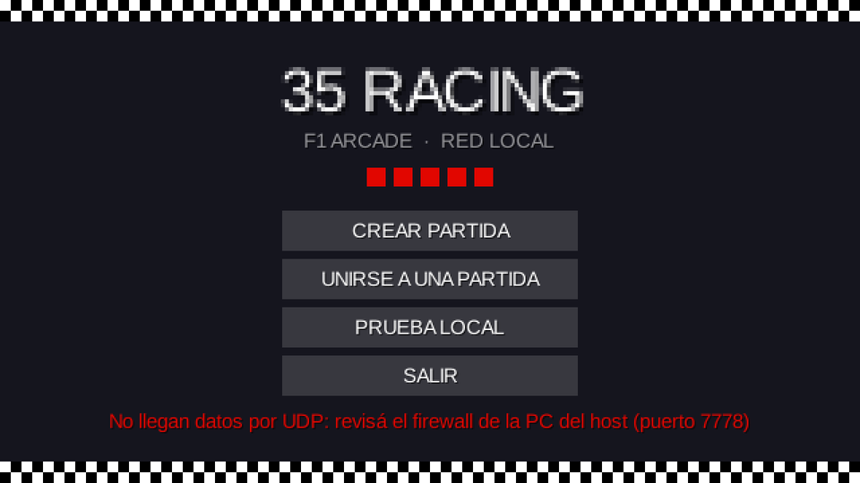
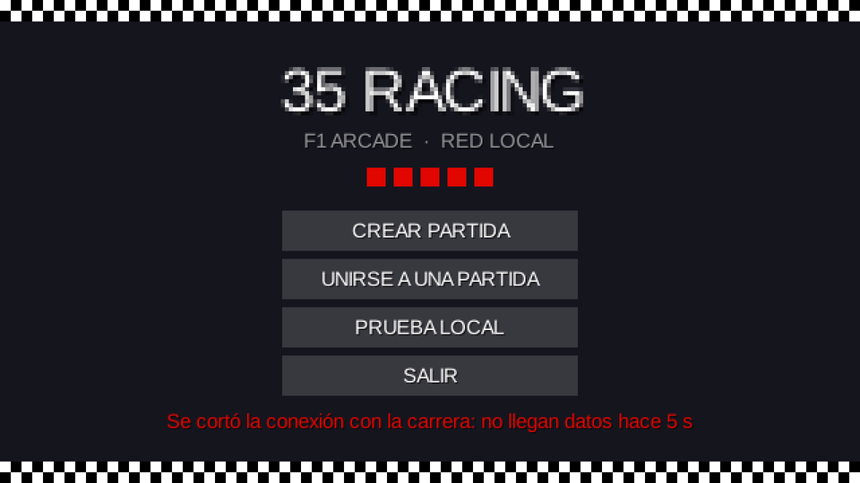
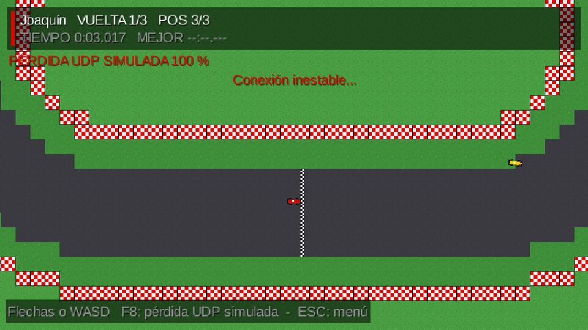

# Etapa 8: Robustez de red

## Objetivo

Que ninguna falla de red deje al juego colgado o muestre un error sin explicar: cada caso tiene que terminar con un mensaje claro en pantalla, sin excepciones sin atrapar ni hilos sueltos. La guía pide resolver la desconexión de un cliente en el lobby o en la carrera, el cierre del host, que no lleguen estados UDP durante un tiempo (`Config.TIMEOUT_RED`), el puerto ocupado, la IP inválida o inalcanzable, la versión distinta, el nombre vacío o repetido, y que cerrar la ventana en cualquier pantalla libere sockets e hilos. Y explicar cómo reproducir cada caso a mano.

## El plan (se mostró y se confirmó antes de programar)

Primero se revisó qué ya estaba resuelto por las etapas 6 y 7 (la caída de un cliente, el cierre del host, el puerto ocupado, la versión, los nombres) y se decidió volver a verificarlo en lugar de darlo por sentado. Lo que faltaba se resolvió en cuatro puntos. El grupo confirmó dos decisiones: `TIMEOUT_RED` de 5 segundos, con un aviso de "conexión inestable" a 1 segundo; y que una falla inesperada del servidor cierre la partida para todos (es lo más seguro: una partida con la simulación muerta no se puede continuar).

## Qué se hizo

1. **Sin estados UDP.** La pantalla de carrera en red cuenta cuánto pasa sin recibir estados. A 1 segundo muestra "Conexión inestable...", y a `Config.TIMEOUT_RED` (5 s) vuelve al menú con un aviso. Si nunca llegó ninguno, el mensaje dice lo más probable: *"No llegan datos por UDP: revisá el firewall de la PC del host (puerto 7778)"*. Si se cortó a mitad de carrera: *"Se cortó la conexión con la carrera: no llegan datos hace 5 s"*. No se controla una vez terminada la carrera, porque el servidor deja de mandar estados. Si la ventana se congela un rato, el reloj no acumula más de 0,25 s por cuadro, para que los estados atrasados que llegan enseguida no se tomen por una falla.
2. **Aviso en el servidor.** Si a los 5 segundos de empezar un jugador no mandó ninguna entrada UDP, la consola del host lo dice, con el nombre del jugador y el puerto: es el mismo problema de firewall visto desde el otro lado.
3. **Ningún hilo muere en silencio.**
   - Si falla la simulación del servidor, se registra el error y se cierra la partida con el motivo (por ejemplo, *"Error interno del servidor (IllegalStateException)"*) para todos.
   - Un mensaje TCP que rompa el procesamiento da de baja solo a ese cliente.
   - Un paquete UDP defectuoso se ignora sin detener la recepción, tanto en el servidor como en el cliente.
4. **Cerrar la ventana a prueba de fallas.** `Main.dispose` hace cada paso por separado (ocultar la pantalla, cerrar la partida en red, liberar la pantalla y los recursos), y `SesionRed.cerrar` cierra el servidor aunque falle el cliente. Además, `ClientePartida.cerrar` corta un intento de conexión en curso en vez de esperar el timeout.
5. **Tope de espera al conectar.** El formulario de unirse deja de esperar a los 5 segundos aunque la resolución de un nombre tarde más que el timeout de conexión.
6. **Extra para la demo:** la tecla F8 llega también a 100 % de pérdida simulada (corte total), así se puede mostrar en vivo el aviso y la vuelta al menú sin tocar el firewall.

## Decisiones

- **Volver al menú y no reintentar.** Un corte de 5 segundos en un juego de carreras ya arruinó la partida; reconectar a mitad de carrera es mucho más complejo y no está en el alcance.
- **Un mensaje distinto para cada causa probable.** Ver que nunca llegó ningún estado (casi seguro el firewall) es distinto de que se cortó una conexión que andaba, y al jugador se le dice lo que puede hacer.
- **Las fallas del servidor cierran la partida** en lugar de intentar seguir con un estado dudoso.

## Problemas encontrados y cómo se resolvieron

1. **Un hilo tardaba en morir al cerrar la ventana mientras se conectaba.** La prueba de cierre en cada pantalla mostró que, con un intento de conexión en curso, el hilo de conexión seguía vivo hasta que vencía el timeout de 3 s. No colgaba el programa (es un hilo secundario), pero se corrigió: `cerrar` ahora cierra el socket que se está conectando y el hilo termina al instante.
2. **La primera corrida del cierre en la pantalla del invitado se colgó, pero era un error de la prueba.** Dos jugadores de prueba se conectaron en paralelo y el que quedó como host no era el que mandaba `INICIAR`, así que el servidor rechazó el pedido, como corresponde. Se corrigió la prueba para que inicie el jugador que sea host.
3. **La primera medición de las IP mal escritas era inválida.** El reloj de la prueba arrancaba al armar el paso y no al ejecutarlo. Al corregirla se vio el comportamiento real: todas fallan en menos de 3 segundos.

## Verificación

| Caso | Cómo se comprobó | Resultado |
|---|---|---|
| UDP bloqueado desde el principio | Pérdida simulada al 100 % antes de iniciar, con la pantalla real y jugadores de prueba | A 1,5 s, "Conexión inestable..."; vuelve al menú a los **4.996 ms** con el mensaje del firewall; la sesión queda cerrada. El servidor avisa en su consola por cada jugador |
| UDP que se corta a mitad de carrera | Corte total después de 3 s de carrera | Aviso a 1,4 s del corte; vuelve al menú a los **5.034 ms** |
| Pérdida parcial y cortes cortos (falsas alarmas) | 8 s con 50 % de pérdida; después 3 s de corte total y vuelta de los datos | Se queda en la carrera; con el corte muestra el aviso y al volver los datos, se borra solo |
| Falla inesperada del servidor | Se provoca una excepción dentro de la simulación | Todos reciben `CERRADA` con el motivo en **23 ms** y el servidor queda inactivo |
| IP mal escrita | `abc`, `999.1.1.1`, `192.168.1`, `a b`, una IP que no responde | Todas fallan con mensaje claro en **menos de 3 segundos** (`abc` en 2,3 s por la búsqueda de nombre) |
| Cerrar la ventana en 7 pantallas | Se abre el juego real con la ventana oculta en cada pantalla y se cierra; se revisan hilos vivos y puertos | En **las 7** el proceso termina solo, no quedan hilos de red y los puertos TCP 7777 y UDP 7778 quedan libres. Las pantallas: menú, conectando, lobby del host, carrera del host, resultados, lobby de invitado y carrera de invitado |
| Lo ya hecho en las etapas 6 y 7 | Se repiten sus pruebas | Lobby por TCP: 40 de 40. Carrera por UDP: 43 de 43 |

## Capturas

| Vuelve al menú por el firewall | Vuelve al menú por un corte |
|---|---|
|  |  |

## Cómo reproducir cada caso a mano

Se necesita el proyecto abierto en Eclipse y `Lwjgl3Launcher` ejecutado 2 o 3 veces (una ventana por jugador), o dos PC.

| Caso | Cómo reproducirlo | Qué se tiene que ver |
|---|---|---|
| Un cliente se cae en el lobby | Con dos ventanas en el lobby, cerrar una con la X (o pararla desde Eclipse con el botón rojo) | En la otra, el jugador desaparece de la lista al instante. Con cable desconectado, a los 6 s |
| Un cliente se cae en la carrera | Igual, pero con la carrera en marcha | En las otras, el aviso "X abandonó la carrera" y su auto desaparece; en los resultados figura sin tiempo total |
| El host cierra el juego | Con la carrera o el lobby en marcha, cerrar la ventana del host | Los demás vuelven al menú con "La partida se cerró: ..." |
| No llegan estados UDP a mitad de carrera | En una ventana en carrera, apretar **F8** hasta que diga 100 % | A 1 s, "Conexión inestable..."; a los 5 s vuelve al menú con el aviso. Con F8 de nuevo antes de 5 s (o apretándolo hasta 0 %), sigue la carrera |
| El firewall bloquea el UDP | En la PC del host, crear una regla de entrada que bloquee el UDP 7778 y probar con otra PC. O, más simple, poner 100 % de pérdida antes de iniciar | El invitado, "Esperando al servidor...", "Conexión inestable..." y a los 5 s el menú con "No llegan datos por UDP: revisá el firewall...". En la consola del host, la línea `AVISO: no llegó ninguna ENTRADA UDP de ...` |
| Puerto ocupado al crear la partida | Con una partida ya creada en la PC, crear otra desde una segunda ventana | Mensaje "No se pudo crear la partida: los puertos 7777 y 7778 están ocupados..." y el formulario sigue abierto |
| IP inválida o inalcanzable | En "Unirse", escribir `abc`, `999.1.1.1` o una IP de la red que no exista | En menos de 3 segundos, "No se pudo conectar a ... Revisá la IP y que el anfitrión haya creado la partida" |
| IP vacía | En "Unirse", dejar la IP en blanco | "Escribí la IP del anfitrión" |
| Versión de protocolo distinta | Cambiar `Config.VERSION_PROTOCOLO` a 2 en una de las PC (o ventanas) y volver a compilar | Al unirse, "Tu juego es de otra versión (2, la de la partida es 1)" |
| Nombre vacío, inválido o repetido | Dejar el nombre vacío; escribir uno con símbolos o de más de 12 letras; o unirse con el mismo nombre que otro jugador (aunque cambien las mayúsculas) | "El nombre debe tener de 1 a 12 letras, números o espacios", o "Ya hay un jugador con ese nombre" |
| Partida llena / carrera empezada | Con 5 jugadores en el lobby, intentar unirse con un sexto; o unirse cuando ya empezó la carrera | "La partida está llena" / "La carrera ya empezó" |
| Cerrar la ventana en cualquier pantalla | Cerrar con la X desde cada pantalla (menú, conectando, lobby, carrera, resultados) | El programa termina solo. Se puede comprobar que el puerto quedó libre con `netstat -ano \| findstr 7777` en la consola de Windows (no debe aparecer nada) y que ya no hay un proceso `java` de más en el Administrador de tareas |
| Falla interna del servidor | No se puede provocar a mano con el juego normal; se comprobó con una prueba automática que inyecta la excepción | Todos vuelven al menú con "La partida se cerró: Error interno del servidor (...)" |

## Commits

- Los commits de la etapa están en la rama `feature/robustez-red`.
